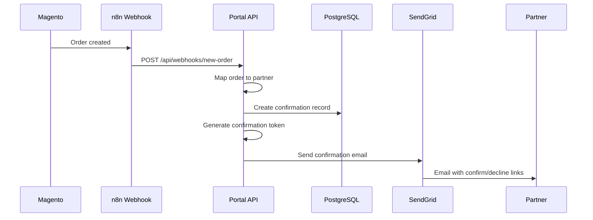
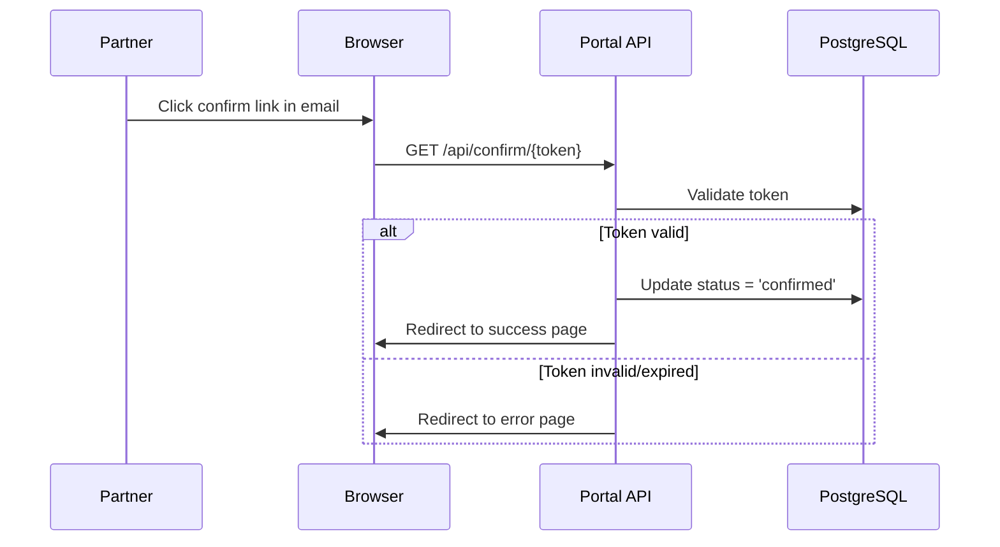
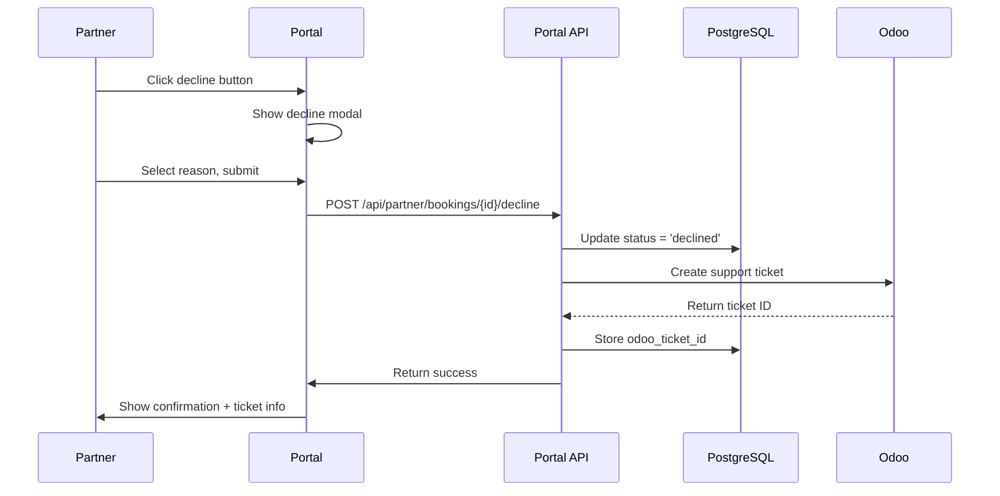
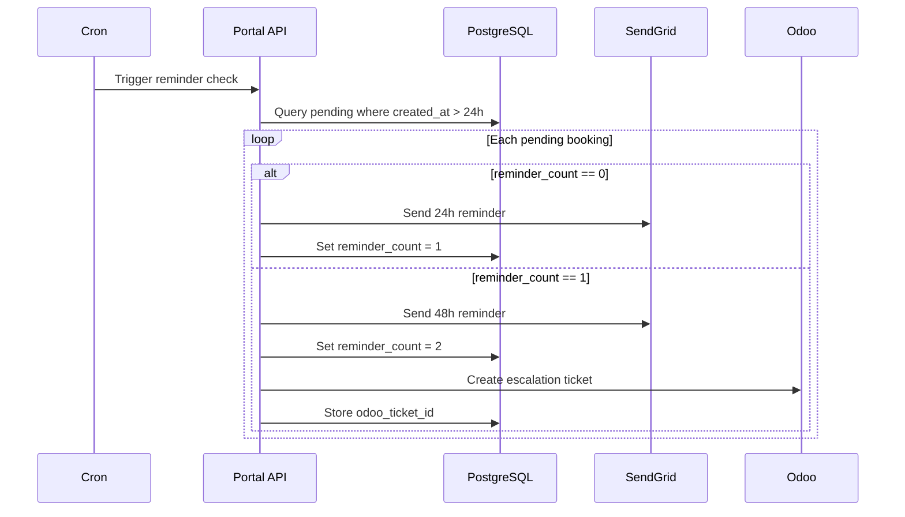

# Feature 01: Booking Confirmation System

**Priority:** HIGH
**Status:** Planned
**Estimated Effort:** 2-3 weeks
**Related:** ROADMAP.md Phase 2 (Orders Management)

---

## Table of Contents

1. [Overview](#overview)
2. [User Stories](#user-stories)
3. [Functional Requirements](#functional-requirements)
4. [Technical Architecture](#technical-architecture)
5. [Database Schema](#database-schema)
6. [API Endpoints](#api-endpoints)
7. [UI Components](#ui-components)
8. [Email System](#email-system)
9. [Workflows](#workflows)
10. [Security Considerations](#security-considerations)
11. [Testing Checklist](#testing-checklist)
12. [Implementation Tasks](#implementation-tasks)

---

## Overview

Partners must confirm or decline customer bookings before the event date. This feature ensures:
- Event capacity management
- Customer satisfaction through timely confirmations
- Clear communication between partners and Miomente

### Problem Statement

Currently, partners receive booking notifications but there's no formal confirmation workflow. This leads to:
- Uncertainty about partner availability
- Last-minute cancellations
- Poor customer experience
- Manual follow-up by Miomente staff

### Solution

A structured confirmation workflow where:
1. Partners receive booking notifications with one-click confirm/decline links
2. Unconfirmed bookings trigger automated reminders
3. Declined bookings automatically create support tickets for rebooking
4. All confirmation statuses are tracked and visible in the portal

---

## User Stories

### Partner Stories

| ID | Story | Acceptance Criteria |
|----|-------|---------------------|
| US-1 | As a partner, I want to see all bookings for my courses so I can manage my schedule | Bookings list shows: customer, course, date, participants, status |
| US-2 | As a partner, I want to confirm a booking with one click from an email so I don't need to log in | Email link confirms booking without authentication |
| US-3 | As a partner, I want to decline a booking and provide a reason so customers can be notified | Decline redirects to portal with reason form |
| US-4 | As a partner, I want to receive reminders about unconfirmed bookings so I don't miss any | Email reminders at 24h and 48h |
| US-5 | As a partner, I want to see which bookings need my attention so I can prioritize | "Needs Confirmation" section highlighted at top |
| US-6 | As a partner, I want to filter bookings by status and date so I can find specific orders | Filters for status, date range, course |

### Manager Stories

| ID | Story | Acceptance Criteria |
|----|-------|---------------------|
| US-7 | As a manager, I want unresponsive partners escalated so I can follow up by phone | Odoo ticket created after 2nd reminder |
| US-8 | As a manager, I want to see confirmation rates per partner so I can identify issues | Dashboard with partner response metrics |

---

## Functional Requirements

### FR-1: Booking Display

| Requirement | Description |
|-------------|-------------|
| FR-1.1 | Display all orders for partner's courses |
| FR-1.2 | Show customer name, email, phone |
| FR-1.3 | Show course name and date |
| FR-1.4 | Show number of participants (qty_ordered) |
| FR-1.5 | Show booking status (pending/confirmed/declined) |
| FR-1.6 | Show order total and payment status |
| FR-1.7 | Sort by confirmation urgency (pending first) |

### FR-2: Confirmation Actions

| Requirement | Description |
|-------------|-------------|
| FR-2.1 | One-click confirm via email token link |
| FR-2.2 | Confirm action updates status to "confirmed" |
| FR-2.3 | Confirm action records timestamp |
| FR-2.4 | Confirmation success page shown after email link |
| FR-2.5 | In-portal confirm button for logged-in users |

### FR-3: Decline Actions

| Requirement | Description |
|-------------|-------------|
| FR-3.1 | Decline link redirects to portal login if needed |
| FR-3.2 | Decline requires reason selection |
| FR-3.3 | Decline creates Odoo support ticket |
| FR-3.4 | Declined booking held for customer rebooking |
| FR-3.5 | Partner prompted to update course dates |

### FR-4: Reminder System

| Requirement | Description |
|-------------|-------------|
| FR-4.1 | First reminder at 24 hours after booking |
| FR-4.2 | Second reminder at 48 hours if still pending |
| FR-4.3 | Escalation to Odoo after second reminder |
| FR-4.4 | No reminders for already confirmed/declined |
| FR-4.5 | Track reminder count per booking |

### FR-5: Filtering & Search

| Requirement | Description |
|-------------|-------------|
| FR-5.1 | Filter by status (all/pending/confirmed/declined) |
| FR-5.2 | Filter by date range |
| FR-5.3 | Filter by course |
| FR-5.4 | Search by customer name or order number |
| FR-5.5 | Pagination (20 items per page) |

---

## Technical Architecture

### System Overview

```
┌─────────────────────────────────────────────────────────────────────────┐
│                           Partner Portal                                 │
│                                                                          │
│  ┌────────────────────┐     ┌────────────────────┐                      │
│  │   Bookings Page    │     │  Confirmation Page │                      │
│  │  /dashboard/bookings│     │  /confirm/:token   │                      │
│  └─────────┬──────────┘     └─────────┬──────────┘                      │
│            │                          │                                  │
│            └──────────────┬───────────┘                                  │
│                           │                                              │
│                  ┌────────▼────────┐                                    │
│                  │   API Routes    │                                    │
│                  └────────┬────────┘                                    │
│                           │                                              │
└───────────────────────────┼──────────────────────────────────────────────┘
                            │
        ┌───────────────────┼───────────────────┐
        │                   │                   │
        ▼                   ▼                   ▼
┌───────────────┐   ┌───────────────┐   ┌───────────────┐
│  PostgreSQL   │   │    MySQL      │   │   External    │
│               │   │   (Magento)   │   │   Services    │
│ - Confirmations│   │ - Orders      │   │ - SendGrid   │
│ - Tokens      │   │ - Order Items │   │ - Odoo       │
│ - Reminders   │   │ - Products    │   │              │
└───────────────┘   └───────────────┘   └───────────────┘
```

### Data Flow: New Booking

```
1. Customer places order in Magento
                ↓
2. n8n webhook triggers booking notification
                ↓
3. Portal creates confirmation record (PostgreSQL)
                ↓
4. Confirmation email sent to partner (SendGrid)
                ↓
5. Partner clicks confirm/decline link
                ↓
6a. Confirm: Update status, show success
6b. Decline: Redirect to portal, create Odoo ticket
```

### Data Flow: Reminder System

```
1. Cron job runs every hour
                ↓
2. Query pending confirmations > 24h old
                ↓
3. Check reminder_count < 2
                ↓
4. Send reminder email
                ↓
5. Increment reminder_count
                ↓
6. If reminder_count == 2, create Odoo ticket
```

---

## Database Schema

### PostgreSQL: Booking Confirmations Table

```sql
-- Create the booking confirmations table
CREATE TABLE miomente_partner_portal_booking_confirmations (
  id SERIAL PRIMARY KEY,

  -- Magento order reference
  magento_order_id INT NOT NULL,
  magento_order_item_id INT NOT NULL,
  magento_order_increment_id VARCHAR(50),

  -- Partner reference
  customer_number VARCHAR(50) NOT NULL,

  -- Status tracking
  status VARCHAR(20) DEFAULT 'pending' CHECK (status IN ('pending', 'confirmed', 'declined')),

  -- Token-based authentication
  confirmation_token VARCHAR(64) UNIQUE NOT NULL,
  token_expires_at TIMESTAMP NOT NULL,

  -- Confirmation details
  confirmed_at TIMESTAMP,
  confirmed_by VARCHAR(50), -- 'email_token' or 'portal'

  -- Decline details
  declined_at TIMESTAMP,
  declined_by VARCHAR(50),
  decline_reason VARCHAR(100),
  decline_notes TEXT,

  -- Reminder tracking
  reminder_count INT DEFAULT 0,
  last_reminder_at TIMESTAMP,
  escalated_at TIMESTAMP,
  odoo_ticket_id VARCHAR(50),

  -- Audit fields
  created_at TIMESTAMP DEFAULT NOW(),
  updated_at TIMESTAMP DEFAULT NOW()
);

-- Indexes for performance
CREATE INDEX idx_booking_conf_customer
  ON miomente_partner_portal_booking_confirmations(customer_number);

CREATE INDEX idx_booking_conf_status
  ON miomente_partner_portal_booking_confirmations(status);

CREATE INDEX idx_booking_conf_token
  ON miomente_partner_portal_booking_confirmations(confirmation_token);

CREATE INDEX idx_booking_conf_magento_order
  ON miomente_partner_portal_booking_confirmations(magento_order_id);

CREATE INDEX idx_booking_conf_pending_reminders
  ON miomente_partner_portal_booking_confirmations(status, reminder_count, created_at)
  WHERE status = 'pending';

-- Trigger for updated_at
CREATE OR REPLACE FUNCTION update_booking_confirmation_timestamp()
RETURNS TRIGGER AS $$
BEGIN
  NEW.updated_at = NOW();
  RETURN NEW;
END;
$$ LANGUAGE plpgsql;

CREATE TRIGGER booking_confirmation_updated
  BEFORE UPDATE ON miomente_partner_portal_booking_confirmations
  FOR EACH ROW
  EXECUTE FUNCTION update_booking_confirmation_timestamp();
```

### Decline Reasons Reference

```sql
-- Reference table for decline reasons (optional, can be hardcoded)
CREATE TABLE miomente_partner_portal_decline_reasons (
  id SERIAL PRIMARY KEY,
  code VARCHAR(50) UNIQUE NOT NULL,
  label_de VARCHAR(255) NOT NULL,
  label_en VARCHAR(255) NOT NULL,
  requires_notes BOOLEAN DEFAULT false,
  sort_order INT DEFAULT 0,
  is_active BOOLEAN DEFAULT true
);

-- Seed data
INSERT INTO miomente_partner_portal_decline_reasons (code, label_de, label_en, sort_order) VALUES
  ('date_unavailable', 'Termin nicht mehr verfügbar', 'Date no longer available', 1),
  ('capacity_full', 'Kapazität erschöpft', 'Capacity full', 2),
  ('equipment_issue', 'Ausstattungsproblem', 'Equipment issue', 3),
  ('personal_reason', 'Persönlicher Grund', 'Personal reason', 4),
  ('other', 'Sonstiges', 'Other', 99);
```

---

## API Endpoints

### GET /api/partner/bookings

List all bookings for the authenticated partner.

**Query Parameters:**
| Parameter | Type | Description |
|-----------|------|-------------|
| status | string | Filter by status: all, pending, confirmed, declined |
| from | string | Start date (YYYY-MM-DD) |
| to | string | End date (YYYY-MM-DD) |
| course_id | number | Filter by course |
| search | string | Search customer name or order number |
| page | number | Page number (default: 1) |
| limit | number | Items per page (default: 20, max: 100) |

**Response:**
```typescript
{
  data: {
    bookings: Booking[];
    pagination: {
      page: number;
      limit: number;
      total: number;
      totalPages: number;
    };
    summary: {
      pending: number;
      confirmed: number;
      declined: number;
    };
  };
  success: true;
}
```

**Booking Object:**
```typescript
interface Booking {
  id: number;
  magentoOrderId: number;
  magentoOrderItemId: number;
  orderNumber: string;

  customer: {
    firstName: string;
    lastName: string;
    email: string;
    phone: string;
  };

  course: {
    id: number;
    name: string;
    sku: string;
  };

  eventDate: string;
  eventTime: string;
  participants: number;

  price: number;
  currency: string;

  status: 'pending' | 'confirmed' | 'declined';
  confirmationStatus: {
    confirmedAt?: string;
    declinedAt?: string;
    declineReason?: string;
  };

  orderDate: string;
  paymentStatus: string;
}
```

---

### GET /api/partner/bookings/pending

Get only bookings that need confirmation (convenience endpoint).

**Response:** Same as `/api/partner/bookings` but pre-filtered to pending only.

---

### POST /api/partner/bookings/:id/confirm

Confirm a booking (requires authentication).

**Request Body:**
```typescript
{
  notes?: string;
}
```

**Response:**
```typescript
{
  data: {
    booking: Booking;
    message: string;
  };
  success: true;
}
```

---

### POST /api/partner/bookings/:id/decline

Decline a booking (requires authentication).

**Request Body:**
```typescript
{
  reason: string;      // Decline reason code
  notes?: string;      // Additional notes
}
```

**Response:**
```typescript
{
  data: {
    booking: Booking;
    odooTicketId: string;
    message: string;
  };
  success: true;
}
```

---

### GET /api/confirm/:token

Token-based confirmation (no authentication required).

**Response (Success):**
- Redirects to `/confirmation-success` page

**Response (Error):**
- Invalid token: Redirects to `/confirmation-error?reason=invalid`
- Expired token: Redirects to `/confirmation-error?reason=expired`
- Already processed: Redirects to `/confirmation-error?reason=already_processed`

---

### GET /api/decline/:token

Token-based decline initiation (redirects to portal).

**Response:**
- Redirects to `/dashboard/bookings/:id/decline` with pre-filled token
- If not logged in, redirects to login first

---

## UI Components

### Bookings Page Layout

```
┌─────────────────────────────────────────────────────────────────┐
│  Buchungen (Bookings)                                           │
├─────────────────────────────────────────────────────────────────┤
│                                                                  │
│  ┌──────────────────────────────────────────────────────────┐   │
│  │  ⚠️  Bestätigungen erforderlich (3)                       │   │
│  │                                                           │   │
│  │  ┌─────────────────────────────────────────────────────┐ │   │
│  │  │ BookingCard (pending)                               │ │   │
│  │  │ Customer: Max Mustermann                            │ │   │
│  │  │ Course: Sushi-Kurs für Anfänger                     │ │   │
│  │  │ Date: 25.01.2025 18:00                              │ │   │
│  │  │ Participants: 2                                      │ │   │
│  │  │                                                      │ │   │
│  │  │ [Bestätigen]  [Ablehnen]                            │ │   │
│  │  └─────────────────────────────────────────────────────┘ │   │
│  │  ... more pending cards ...                              │   │
│  └──────────────────────────────────────────────────────────┘   │
│                                                                  │
│  ┌──────────────────────────────────────────────────────────┐   │
│  │  Alle Buchungen                                          │   │
│  │                                                           │   │
│  │  Filters: [Status ▼] [Datum ▼] [Kurs ▼] [🔍 Suche...]   │   │
│  │                                                           │   │
│  │  ┌─────────────────────────────────────────────────────┐ │   │
│  │  │ BookingCard (confirmed)                             │ │   │
│  │  │ ✅ Bestätigt am 20.01.2025                          │ │   │
│  │  └─────────────────────────────────────────────────────┘ │   │
│  │                                                           │   │
│  │  ┌─────────────────────────────────────────────────────┐ │   │
│  │  │ BookingCard (declined)                              │ │   │
│  │  │ ❌ Abgelehnt: Termin nicht verfügbar                │ │   │
│  │  └─────────────────────────────────────────────────────┘ │   │
│  │                                                           │   │
│  │  [← Zurück] Page 1 of 5 [Weiter →]                       │   │
│  └──────────────────────────────────────────────────────────┘   │
│                                                                  │
└─────────────────────────────────────────────────────────────────┘
```

### BookingCard Component

```typescript
// src/components/booking-card.tsx

interface BookingCardProps {
  booking: Booking;
  onConfirm?: (id: number) => void;
  onDecline?: (id: number) => void;
  showActions?: boolean;
}

// Visual states:
// - pending: Yellow border, prominent action buttons
// - confirmed: Green border, checkmark badge
// - declined: Red border, X badge with reason
```

### Decline Modal

```
┌─────────────────────────────────────────────────────────────────┐
│  Buchung ablehnen                                        [X]   │
├─────────────────────────────────────────────────────────────────┤
│                                                                  │
│  Bitte wählen Sie einen Grund:                                  │
│                                                                  │
│  ○ Termin nicht mehr verfügbar                                  │
│  ○ Kapazität erschöpft                                          │
│  ○ Ausstattungsproblem                                          │
│  ○ Persönlicher Grund                                           │
│  ○ Sonstiges                                                    │
│                                                                  │
│  Zusätzliche Anmerkungen (optional):                            │
│  ┌─────────────────────────────────────────────────────────┐   │
│  │                                                          │   │
│  │                                                          │   │
│  └─────────────────────────────────────────────────────────┘   │
│                                                                  │
│  ⚠️ Ein Support-Ticket wird automatisch erstellt, um den        │
│     Kunden bei der Umbuchung zu unterstützen.                   │
│                                                                  │
│                    [Abbrechen]  [Ablehnen]                      │
│                                                                  │
└─────────────────────────────────────────────────────────────────┘
```

### Confirmation Success Page

```
┌─────────────────────────────────────────────────────────────────┐
│                                                                  │
│                         ✅                                       │
│                                                                  │
│              Buchung erfolgreich bestätigt!                     │
│                                                                  │
│  Bestellung: #100012345                                         │
│  Kunde: Max Mustermann                                          │
│  Kurs: Sushi-Kurs für Anfänger                                  │
│  Datum: 25.01.2025 18:00                                        │
│                                                                  │
│              [Zum Partner-Portal →]                             │
│                                                                  │
└─────────────────────────────────────────────────────────────────┘
```

---

## Email System

### Email Templates

#### 1. Confirmation Request Email

**Subject:** `Neue Buchung: {customer_name} - {course_name} am {date}`

```html
Hallo {partner_name},

Sie haben eine neue Buchung erhalten:

BUCHUNGSDETAILS
───────────────
Bestellung: #{order_number}
Kunde: {customer_name}
E-Mail: {customer_email}
Telefon: {customer_phone}

Kurs: {course_name}
Datum: {event_date} um {event_time}
Teilnehmer: {participants}
Preis: {price} €

AKTION ERFORDERLICH
───────────────────
Bitte bestätigen Sie diese Buchung:

[✅ BUCHUNG BESTÄTIGEN] ← Green button, links to /api/confirm/{token}

Falls Sie diese Buchung nicht durchführen können:

[❌ Buchung ablehnen] ← Red link, links to /api/decline/{token}

Diese Links sind 7 Tage gültig.

Bei Fragen erreichen Sie uns unter support@miomente.de

Mit freundlichen Grüßen,
Ihr Miomente Team
```

#### 2. Reminder Email (24h)

**Subject:** `Erinnerung: Buchung bestätigen - {customer_name}`

```html
Hallo {partner_name},

Diese Buchung wartet noch auf Ihre Bestätigung:

[Buchungsdetails wie oben]

Bitte bestätigen Sie zeitnah, damit wir den Kunden informieren können.

[✅ BUCHUNG BESTÄTIGEN]

[❌ Buchung ablehnen]
```

#### 3. Reminder Email (48h - Final)

**Subject:** `Dringend: Buchung {order_number} noch nicht bestätigt`

```html
Hallo {partner_name},

Diese Buchung ist seit 48 Stunden unbestätigt:

[Buchungsdetails]

⚠️ Falls wir keine Rückmeldung erhalten, werden wir Sie telefonisch kontaktieren.

[✅ BUCHUNG BESTÄTIGEN]

[❌ Buchung ablehnen]
```

#### 4. Decline Confirmation Email (to Partner)

**Subject:** `Buchung abgelehnt - #{order_number}`

```html
Hallo {partner_name},

Sie haben folgende Buchung abgelehnt:

[Buchungsdetails]

Grund: {decline_reason}

Wir haben ein Support-Ticket erstellt (#{odoo_ticket_id}) und werden
den Kunden bei der Umbuchung unterstützen.

💡 Tipp: Bitte prüfen Sie Ihre verfügbaren Termine im Partner-Portal
und aktualisieren Sie diese bei Bedarf.

[Termine verwalten →]
```

### Email Implementation

```typescript
// src/lib/email/templates/booking-confirmation.ts

export interface BookingConfirmationEmailData {
  partnerName: string;
  partnerEmail: string;
  orderNumber: string;
  customer: {
    name: string;
    email: string;
    phone: string;
  };
  course: {
    name: string;
    date: string;
    time: string;
  };
  participants: number;
  price: string;
  confirmUrl: string;
  declineUrl: string;
  language: 'de' | 'en';
}

export async function sendBookingConfirmationEmail(
  data: BookingConfirmationEmailData
): Promise<void> {
  // Use SendGrid dynamic templates
  // Template ID configured in environment
}
```

---

## Workflows

### Workflow 1: New Booking Confirmation Request



### Workflow 2: Token-Based Confirmation



### Workflow 3: Decline with Odoo Ticket



### Workflow 4: Reminder System



---

## Security Considerations

### Token Security

| Concern | Mitigation |
|---------|------------|
| Token guessing | 64-character cryptographically random token |
| Token reuse | Single-use tokens, marked as used after first action |
| Token expiration | 7-day expiry, configurable |
| Token in URL | Acceptable for email links, HTTPS only |

### API Security

| Concern | Mitigation |
|---------|------------|
| Unauthorized access | JWT authentication for portal endpoints |
| Partner isolation | All queries filtered by customer_number |
| Rate limiting | 100 requests/minute per partner |
| Input validation | Zod schemas for all inputs |

### Data Privacy

| Concern | Mitigation |
|---------|------------|
| Customer data exposure | Partners only see their own bookings |
| Logging | No PII in logs, order IDs only |
| Token in email | Partner's registered email only |

---

## Testing Checklist

### Unit Tests

- [ ] Token generation produces 64-char random strings
- [ ] Token validation rejects expired tokens
- [ ] Token validation rejects used tokens
- [ ] Booking query filters by customer_number
- [ ] Decline reason validation
- [ ] Email template rendering

### Integration Tests

- [ ] Create confirmation record on new order
- [ ] Token confirmation updates status
- [ ] Token decline redirects correctly
- [ ] Odoo ticket created on decline
- [ ] Reminder emails sent at correct intervals
- [ ] Escalation after 2 reminders

### E2E Tests

- [ ] Partner sees bookings list
- [ ] Partner can filter bookings
- [ ] Partner can confirm via portal
- [ ] Partner can decline via portal
- [ ] Email confirm link works
- [ ] Email decline link works
- [ ] Success/error pages display correctly

### Manual Testing

- [ ] Create test order in Magento
- [ ] Verify booking appears in portal
- [ ] Test email confirmation link
- [ ] Test email decline link
- [ ] Test reminder emails (24h timing)
- [ ] Test escalation after 2 reminders
- [ ] Test Odoo ticket creation
- [ ] Test in both DE and EN languages

---

## Implementation Tasks

### Phase 1: Database & Core (Days 1-3)

| Task | Description | Files |
|------|-------------|-------|
| 1.1 | Create PostgreSQL migration | `docs/migrations/XXX_booking_confirmations.sql` |
| 1.2 | Run migration on dev database | - |
| 1.3 | Add TypeScript types | `src/lib/types.ts` |
| 1.4 | Create database queries | `src/lib/db/queries/bookings.ts` |
| 1.5 | Create token generation utility | `src/lib/utils/tokens.ts` |

### Phase 2: Magento Integration (Days 4-5)

| Task | Description | Files |
|------|-------------|-------|
| 2.1 | Create Magento order query | `src/lib/db/queries/magento-orders.ts` |
| 2.2 | Map orders to partners | `src/lib/services/order-mapping.ts` |
| 2.3 | Test order queries | - |

### Phase 3: API Endpoints (Days 6-8)

| Task | Description | Files |
|------|-------------|-------|
| 3.1 | GET /api/partner/bookings | `src/app/api/partner/bookings/route.ts` |
| 3.2 | POST /api/partner/bookings/:id/confirm | `src/app/api/partner/bookings/[id]/confirm/route.ts` |
| 3.3 | POST /api/partner/bookings/:id/decline | `src/app/api/partner/bookings/[id]/decline/route.ts` |
| 3.4 | GET /api/confirm/:token | `src/app/api/confirm/[token]/route.ts` |
| 3.5 | GET /api/decline/:token | `src/app/api/decline/[token]/route.ts` |

### Phase 4: UI Components (Days 9-11)

| Task | Description | Files |
|------|-------------|-------|
| 4.1 | BookingCard component | `src/components/booking-card.tsx` |
| 4.2 | Bookings page | `src/app/dashboard/bookings/page.tsx` |
| 4.3 | Decline modal | `src/components/decline-modal.tsx` |
| 4.4 | Confirmation success page | `src/app/confirmation-success/page.tsx` |
| 4.5 | Confirmation error page | `src/app/confirmation-error/page.tsx` |
| 4.6 | Add i18n strings | `src/lib/dictionaries.ts` |

### Phase 5: Email System (Days 12-13)

| Task | Description | Files |
|------|-------------|-------|
| 5.1 | Create SendGrid templates | SendGrid dashboard |
| 5.2 | Email sending functions | `src/lib/email/booking-emails.ts` |
| 5.3 | Test email delivery | - |

### Phase 6: Odoo Integration (Day 14)

| Task | Description | Files |
|------|-------------|-------|
| 6.1 | Create decline ticket function | `src/lib/services/odoo.ts` |
| 6.2 | Create escalation ticket function | `src/lib/services/odoo.ts` |
| 6.3 | Test ticket creation | - |

### Phase 7: Reminder System (Days 15-16)

| Task | Description | Files |
|------|-------------|-------|
| 7.1 | Create reminder API endpoint | `src/app/api/cron/booking-reminders/route.ts` |
| 7.2 | Configure Cloud Scheduler | GCP console |
| 7.3 | Test reminder flow | - |

### Phase 8: Testing & Polish (Days 17-20)

| Task | Description | Files |
|------|-------------|-------|
| 8.1 | End-to-end testing | - |
| 8.2 | Fix bugs | - |
| 8.3 | Documentation | - |
| 8.4 | Deploy to staging | - |
| 8.5 | Deploy to production | - |

---

## File Structure

```
src/
├── app/
│   ├── api/
│   │   ├── partner/
│   │   │   └── bookings/
│   │   │       ├── route.ts              # GET list
│   │   │       └── [id]/
│   │   │           ├── confirm/
│   │   │           │   └── route.ts      # POST confirm
│   │   │           └── decline/
│   │   │               └── route.ts      # POST decline
│   │   ├── confirm/
│   │   │   └── [token]/
│   │   │       └── route.ts              # Token confirm
│   │   ├── decline/
│   │   │   └── [token]/
│   │   │       └── route.ts              # Token decline redirect
│   │   └── cron/
│   │       └── booking-reminders/
│   │           └── route.ts              # Cron endpoint
│   ├── dashboard/
│   │   └── bookings/
│   │       ├── page.tsx                  # Bookings list
│   │       └── [id]/
│   │           └── decline/
│   │               └── page.tsx          # Decline form
│   ├── confirmation-success/
│   │   └── page.tsx                      # Success page
│   └── confirmation-error/
│       └── page.tsx                      # Error page
├── components/
│   ├── booking-card.tsx                  # Booking display card
│   └── decline-modal.tsx                 # Decline reason modal
├── lib/
│   ├── db/
│   │   └── queries/
│   │       ├── bookings.ts               # Confirmation queries
│   │       └── magento-orders.ts         # Magento order queries
│   ├── email/
│   │   └── booking-emails.ts             # Email functions
│   ├── services/
│   │   └── odoo.ts                       # Add decline/escalation
│   ├── utils/
│   │   └── tokens.ts                     # Token generation
│   └── types.ts                          # Add Booking types
└── ...
```

---

## Dependencies

No new dependencies required. Uses existing:
- `@sendgrid/mail` - Email sending
- `pg` - PostgreSQL connection
- `mysql2` - Magento MySQL connection
- `crypto` - Token generation (Node.js built-in)
- `zod` - Validation
- `react-query` - Data fetching

---

## Configuration

### Environment Variables

```env
# Existing
SENDGRID_API_KEY=...
DATABASE_URL=...
MAGENTO_DB_HOST=...

# New (optional, with defaults)
BOOKING_TOKEN_EXPIRY_DAYS=7
REMINDER_FIRST_HOURS=24
REMINDER_SECOND_HOURS=48
BOOKING_REMINDER_CRON_SECRET=...
```

### SendGrid Template IDs

```env
SENDGRID_TEMPLATE_BOOKING_CONFIRMATION=d-xxx
SENDGRID_TEMPLATE_BOOKING_REMINDER=d-xxx
SENDGRID_TEMPLATE_BOOKING_DECLINED=d-xxx
```

---

## Open Questions

1. **Customer notification:** Should we also send email to customer when partner confirms? (Currently not in scope)
2. **Batch operations:** Should partners be able to confirm/decline multiple bookings at once?
3. **Mobile app:** Are there plans for a mobile app that would need push notifications?
4. **Audit log:** Do we need a detailed audit log of all confirmation actions?

---

## Changelog

| Date | Author | Change |
|------|--------|--------|
| 2025-01-21 | Claude | Initial specification created |
