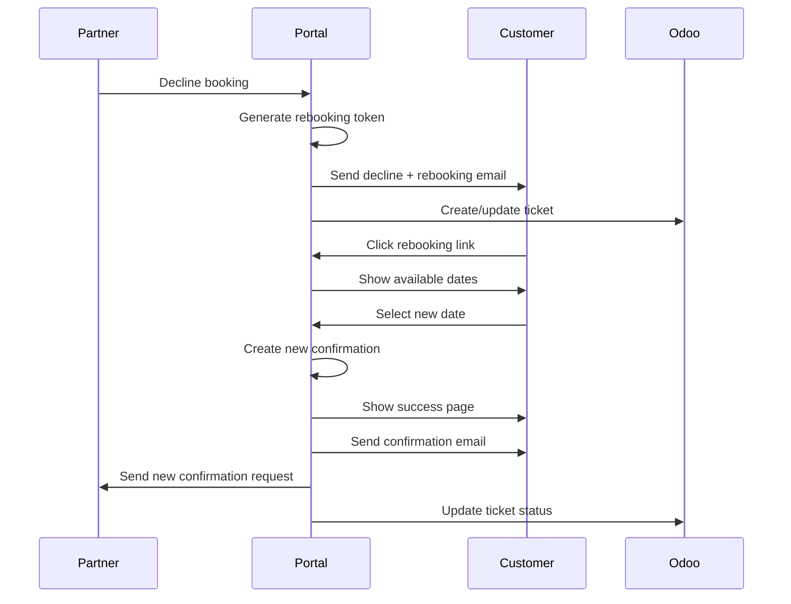

# Feature 02: Rebooking System

**Priority:** Medium
**Status:** Planned
**Depends On:** Feature 01 (Booking Confirmation System)
**Estimated Effort:** 1-2 weeks

---

## Table of Contents

1. [Overview](#overview)
2. [User Stories](#user-stories)
3. [Functional Requirements](#functional-requirements)
4. [Technical Architecture](#technical-architecture)
5. [Database Schema](#database-schema)
6. [API Endpoints](#api-endpoints)
7. [UI Components](#ui-components)
8. [Email System](#email-system)
9. [Workflows](#workflows)
10. [Implementation Tasks](#implementation-tasks)

---

## Overview

When a booking is declined by a partner or a course date needs to be changed, customers should be able to easily select an alternative date without going through the full booking process again.

### Problem Statement

When partners decline bookings:
- Customers need to manually find new dates
- Support staff must coordinate rebookings
- High friction leads to refund requests
- Lost revenue from abandoned rebookings

### Solution

An automated rebooking system where:
1. Declined bookings generate unique rebooking links
2. Customers can view available alternative dates (no login required)
3. Customer selects new date
4. New booking triggers confirmation request to partner
5. Support tickets auto-update with rebooking status

---

## User Stories

### Customer Stories

| ID | Story | Acceptance Criteria |
|----|-------|---------------------|
| US-1 | As a customer, I want to receive a rebooking link when my date is declined | Email contains unique rebooking link |
| US-2 | As a customer, I want to see available dates without logging in | Rebooking page shows dates, no login |
| US-3 | As a customer, I want to select a new date easily | One-click date selection |
| US-4 | As a customer, I want confirmation that my rebooking worked | Success page with new date details |

### Partner Stories

| ID | Story | Acceptance Criteria |
|----|-------|---------------------|
| US-5 | As a partner, I want to see when a declined booking is rebooked | Rebooking status visible in portal |
| US-6 | As a partner, I want to receive confirmation requests for rebookings | Normal confirmation flow for rebooked dates |

### Support Stories

| ID | Story | Acceptance Criteria |
|----|-------|---------------------|
| US-7 | As support, I want tickets auto-updated when customers rebook | Odoo ticket updated with new date |
| US-8 | As support, I want to manually trigger rebooking links | Admin action to send rebooking email |

---

## Functional Requirements

### FR-1: Rebooking Link Generation

| Requirement | Description |
|-------------|-------------|
| FR-1.1 | Generate unique rebooking token on decline |
| FR-1.2 | Token valid for 30 days |
| FR-1.3 | Token tied to original order |
| FR-1.4 | Link included in decline notification email to customer |

### FR-2: Rebooking Page (Customer-Facing)

| Requirement | Description |
|-------------|-------------|
| FR-2.1 | No authentication required |
| FR-2.2 | Show original booking details |
| FR-2.3 | Display available dates for same course |
| FR-2.4 | Filter: only future dates with availability |
| FR-2.5 | Show date, time, price for each option |
| FR-2.6 | One-click selection |

### FR-3: Rebooking Processing

| Requirement | Description |
|-------------|-------------|
| FR-3.1 | Update original order in Magento (or create linked order) |
| FR-3.2 | Create new confirmation request |
| FR-3.3 | Invalidate rebooking token (single use) |
| FR-3.4 | Update Odoo ticket with rebooking info |

### FR-4: Notifications

| Requirement | Description |
|-------------|-------------|
| FR-4.1 | Email customer with decline + rebooking link |
| FR-4.2 | Email customer with rebooking confirmation |
| FR-4.3 | Email partner with new confirmation request |

---

## Technical Architecture

### System Overview

```
┌─────────────────────────────────────────────────────────────────────────┐
│                         Rebooking Flow                                   │
│                                                                          │
│   ┌─────────────┐     ┌─────────────┐     ┌─────────────┐              │
│   │   Decline   │────▶│  Generate   │────▶│   Send      │              │
│   │   Booking   │     │   Token     │     │   Email     │              │
│   └─────────────┘     └─────────────┘     └──────┬──────┘              │
│                                                   │                      │
│                                                   ▼                      │
│   ┌─────────────┐     ┌─────────────┐     ┌─────────────┐              │
│   │   Create    │◀────│   Select    │◀────│   View      │              │
│   │   Rebook    │     │    Date     │     │   Options   │              │
│   └──────┬──────┘     └─────────────┘     └─────────────┘              │
│          │                                       ▲                      │
│          │                                       │                      │
│          │            Customer clicks link ──────┘                      │
│          │                                                              │
│          ▼                                                              │
│   ┌─────────────┐     ┌─────────────┐                                  │
│   │   New       │────▶│   Partner   │                                  │
│   │   Confirm   │     │   Confirms  │                                  │
│   └─────────────┘     └─────────────┘                                  │
│                                                                          │
└─────────────────────────────────────────────────────────────────────────┘
```

### Data Flow

```
1. Partner declines booking (Feature 01)
           ↓
2. System generates rebooking token
           ↓
3. Customer receives email with rebooking link
           ↓
4. Customer clicks link → /rebook/{token}
           ↓
5. Page loads available dates for same course
           ↓
6. Customer selects new date
           ↓
7. System creates rebooking record
           ↓
8. System triggers confirmation flow (Feature 01)
           ↓
9. Partner receives new confirmation request
```

---

## Database Schema

### PostgreSQL: Rebooking Tokens Table

```sql
CREATE TABLE miomente_partner_portal_rebooking_tokens (
  id SERIAL PRIMARY KEY,

  -- Original booking reference
  original_confirmation_id INT NOT NULL REFERENCES miomente_partner_portal_booking_confirmations(id),
  original_order_id INT NOT NULL,
  original_order_item_id INT NOT NULL,

  -- Course reference (for finding alternatives)
  course_product_id INT NOT NULL,
  course_sku VARCHAR(100),

  -- Customer info (for display)
  customer_email VARCHAR(255) NOT NULL,
  customer_name VARCHAR(255),
  original_participants INT NOT NULL,
  original_price DECIMAL(10,2),

  -- Token
  token VARCHAR(64) UNIQUE NOT NULL,
  token_expires_at TIMESTAMP NOT NULL,

  -- Status
  status VARCHAR(20) DEFAULT 'active' CHECK (status IN ('active', 'used', 'expired', 'cancelled')),

  -- Rebooking result
  new_confirmation_id INT REFERENCES miomente_partner_portal_booking_confirmations(id),
  new_order_id INT,
  new_date DATE,
  rebooked_at TIMESTAMP,

  -- Odoo reference
  odoo_ticket_id VARCHAR(50),

  -- Audit
  created_at TIMESTAMP DEFAULT NOW(),
  updated_at TIMESTAMP DEFAULT NOW()
);

-- Indexes
CREATE INDEX idx_rebooking_token ON miomente_partner_portal_rebooking_tokens(token);
CREATE INDEX idx_rebooking_status ON miomente_partner_portal_rebooking_tokens(status);
CREATE INDEX idx_rebooking_original_order ON miomente_partner_portal_rebooking_tokens(original_order_id);

-- Trigger for updated_at
CREATE TRIGGER rebooking_token_updated
  BEFORE UPDATE ON miomente_partner_portal_rebooking_tokens
  FOR EACH ROW
  EXECUTE FUNCTION update_booking_confirmation_timestamp();
```

---

## API Endpoints

### GET /api/rebook/:token

Get rebooking page data (no authentication).

**Response:**
```typescript
{
  data: {
    token: string;
    originalBooking: {
      orderNumber: string;
      courseName: string;
      originalDate: string;
      participants: number;
      customerName: string;
    };
    availableDates: Array<{
      id: number;
      date: string;
      time: string;
      spotsAvailable: number;
      price: number;
      currency: string;
    }>;
    expiresAt: string;
  };
  success: true;
}
```

**Errors:**
- 404: Token not found
- 410: Token expired or already used

---

### POST /api/rebook/:token

Process rebooking selection.

**Request Body:**
```typescript
{
  selectedDateId: number;
  customerEmail: string; // Verify matches original
}
```

**Response:**
```typescript
{
  data: {
    success: true;
    newOrderNumber: string;
    newDate: string;
    message: string;
  };
}
```

---

### GET /api/partner/rebookings

List rebookings for partner's courses.

**Response:**
```typescript
{
  data: {
    rebookings: Array<{
      id: number;
      originalOrderNumber: string;
      originalDate: string;
      newOrderNumber: string;
      newDate: string;
      customerName: string;
      status: string;
      rebooked_at: string;
    }>;
  };
}
```

---

## UI Components

### Rebooking Page (Customer-Facing)

```
┌─────────────────────────────────────────────────────────────────┐
│                                                                  │
│                    🔄 Termin umbuchen                            │
│                                                                  │
├─────────────────────────────────────────────────────────────────┤
│                                                                  │
│  Ihre ursprüngliche Buchung:                                    │
│  ┌────────────────────────────────────────────────────────────┐ │
│  │ Bestellung: #100012345                                      │ │
│  │ Kurs: Sushi-Kurs für Anfänger                               │ │
│  │ Ursprünglicher Termin: 25.01.2025 (abgelehnt)              │ │
│  │ Teilnehmer: 2                                               │ │
│  └────────────────────────────────────────────────────────────┘ │
│                                                                  │
│  Bitte wählen Sie einen neuen Termin:                           │
│                                                                  │
│  ┌────────────────────────────────────────────────────────────┐ │
│  │  📅 Samstag, 01.02.2025                                    │ │
│  │     18:00 - 21:00 Uhr                                       │ │
│  │     5 Plätze verfügbar                                      │ │
│  │     89,00 € pro Person                                      │ │
│  │                                          [Auswählen]        │ │
│  └────────────────────────────────────────────────────────────┘ │
│                                                                  │
│  ┌────────────────────────────────────────────────────────────┐ │
│  │  📅 Samstag, 08.02.2025                                    │ │
│  │     18:00 - 21:00 Uhr                                       │ │
│  │     8 Plätze verfügbar                                      │ │
│  │     89,00 € pro Person                                      │ │
│  │                                          [Auswählen]        │ │
│  └────────────────────────────────────────────────────────────┘ │
│                                                                  │
│  ┌────────────────────────────────────────────────────────────┐ │
│  │  📅 Sonntag, 15.02.2025                                    │ │
│  │     14:00 - 17:00 Uhr                                       │ │
│  │     3 Plätze verfügbar                                      │ │
│  │     89,00 € pro Person                                      │ │
│  │                                          [Auswählen]        │ │
│  └────────────────────────────────────────────────────────────┘ │
│                                                                  │
│  💡 Kein passender Termin dabei?                                │
│     Kontaktieren Sie uns: support@miomente.de                   │
│                                                                  │
└─────────────────────────────────────────────────────────────────┘
```

### Rebooking Success Page

```
┌─────────────────────────────────────────────────────────────────┐
│                                                                  │
│                         ✅                                       │
│                                                                  │
│              Umbuchung erfolgreich!                             │
│                                                                  │
│  Ihre Buchung wurde auf den neuen Termin umgebucht:            │
│                                                                  │
│  Kurs: Sushi-Kurs für Anfänger                                  │
│  Neuer Termin: Samstag, 01.02.2025, 18:00 Uhr                  │
│  Teilnehmer: 2                                                  │
│                                                                  │
│  Sie erhalten in Kürze eine Bestätigung per E-Mail.            │
│                                                                  │
│              [Zur Miomente-Startseite →]                        │
│                                                                  │
└─────────────────────────────────────────────────────────────────┘
```

### No Dates Available Page

```
┌─────────────────────────────────────────────────────────────────┐
│                                                                  │
│                         😔                                       │
│                                                                  │
│         Leider keine Termine verfügbar                          │
│                                                                  │
│  Für diesen Kurs sind aktuell keine weiteren Termine           │
│  verfügbar.                                                     │
│                                                                  │
│  Unser Support-Team wird sich bei Ihnen melden, um             │
│  eine Lösung zu finden.                                         │
│                                                                  │
│  Oder kontaktieren Sie uns direkt:                              │
│  📧 support@miomente.de                                         │
│  📞 +49 xxx xxxxxxx                                             │
│                                                                  │
└─────────────────────────────────────────────────────────────────┘
```

---

## Email System

### Email 1: Decline with Rebooking Link (to Customer)

**Subject:** `Terminänderung für Ihre Buchung #{order_number}`

```html
Hallo {customer_name},

leider müssen wir Ihnen mitteilen, dass Ihr gebuchter Termin nicht
stattfinden kann:

URSPRÜNGLICHE BUCHUNG
─────────────────────
Bestellung: #{order_number}
Kurs: {course_name}
Termin: {original_date}
Teilnehmer: {participants}

Grund: {decline_reason}

EINFACH UMBUCHEN
────────────────
Wir haben alternative Termine für Sie. Klicken Sie einfach auf den
Link unten, um einen neuen Termin auszuwählen:

[NEUEN TERMIN WÄHLEN] ← Button, links to /rebook/{token}

Dieser Link ist 30 Tage gültig.

Bei Fragen stehen wir Ihnen gerne zur Verfügung.

Mit freundlichen Grüßen,
Ihr Miomente Team
```

### Email 2: Rebooking Confirmation (to Customer)

**Subject:** `Umbuchung bestätigt - #{order_number}`

```html
Hallo {customer_name},

Ihre Umbuchung war erfolgreich!

NEUE BUCHUNGSDETAILS
────────────────────
Bestellung: #{order_number}
Kurs: {course_name}
Neuer Termin: {new_date}
Teilnehmer: {participants}

Der Partner wird Ihren Termin in Kürze bestätigen. Sie erhalten
eine weitere E-Mail, sobald die Bestätigung vorliegt.

Mit freundlichen Grüßen,
Ihr Miomente Team
```

---

## Workflows

### Workflow: Complete Rebooking Flow



---

## Implementation Tasks

### Phase 1: Database & Core (Days 1-2)

| Task | Description |
|------|-------------|
| 1.1 | Create rebooking_tokens table migration |
| 1.2 | Add rebooking token generation to decline flow |
| 1.3 | Create rebooking queries |

### Phase 2: Customer-Facing Pages (Days 3-5)

| Task | Description |
|------|-------------|
| 2.1 | Create /rebook/[token] page |
| 2.2 | Implement date selection UI |
| 2.3 | Create success/error pages |
| 2.4 | Test no-auth flow |

### Phase 3: Processing & Integration (Days 6-8)

| Task | Description |
|------|-------------|
| 3.1 | Implement rebooking POST endpoint |
| 3.2 | Integrate with confirmation system |
| 3.3 | Update Odoo ticket integration |

### Phase 4: Emails & Testing (Days 9-10)

| Task | Description |
|------|-------------|
| 4.1 | Create email templates |
| 4.2 | End-to-end testing |
| 4.3 | Deploy |

---

## File Structure

```
src/
├── app/
│   ├── api/
│   │   └── rebook/
│   │       └── [token]/
│   │           └── route.ts          # GET info, POST rebooking
│   └── rebook/
│       └── [token]/
│           ├── page.tsx              # Customer rebooking page
│           ├── success/
│           │   └── page.tsx          # Success page
│           └── error/
│               └── page.tsx          # Error page
├── lib/
│   ├── db/
│   │   └── queries/
│   │       └── rebookings.ts         # Rebooking queries
│   └── email/
│       └── rebooking-emails.ts       # Email functions
└── ...
```

---

## Open Questions

1. **Price difference handling:** What if new date has different price?
   - Same price: No action needed
   - Higher price: Request additional payment?
   - Lower price: Issue partial refund?

2. **Multiple rebookings:** Can a customer rebook multiple times?

3. **Magento order handling:** Create new order or modify existing?

---

## Changelog

| Date | Author | Change |
|------|--------|--------|
| 2025-01-21 | Claude | Initial specification created |
