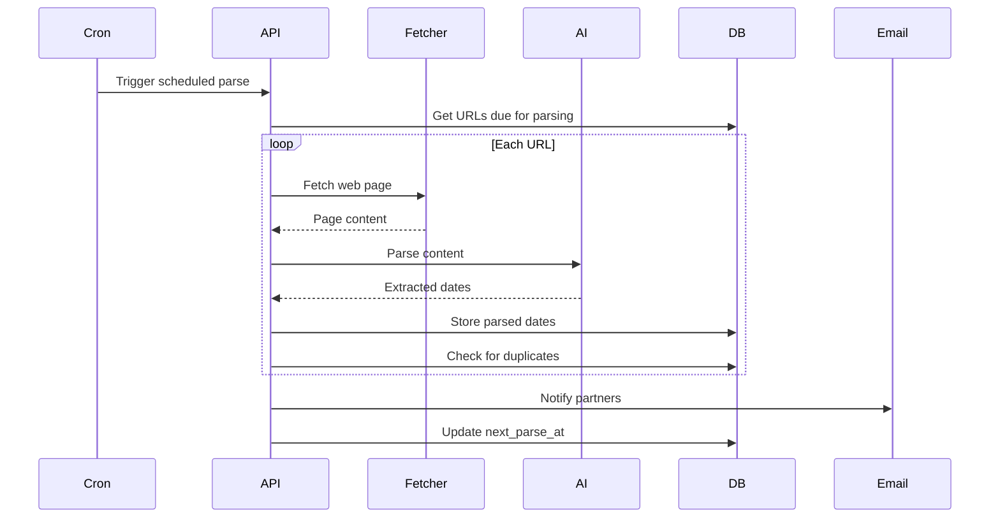
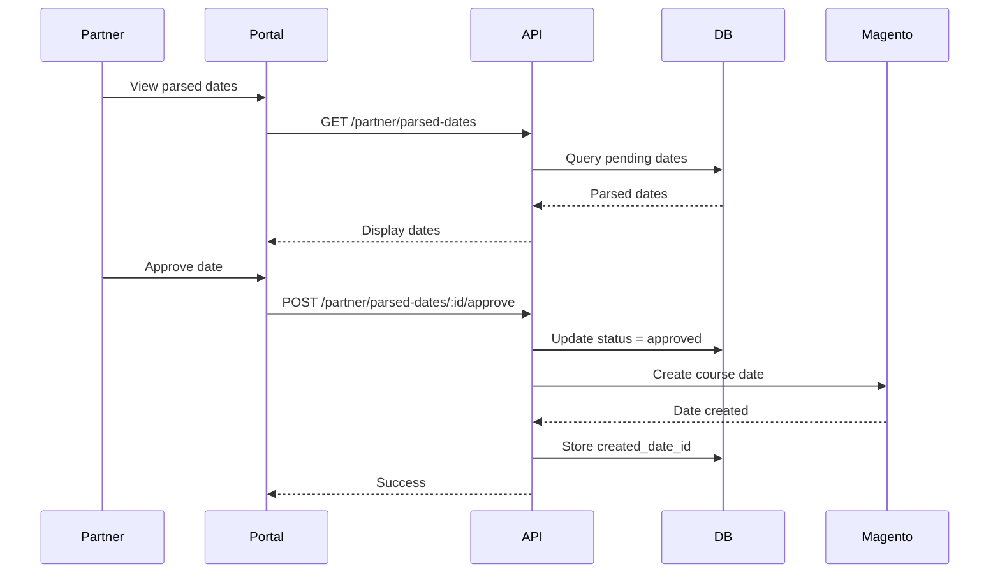

# Feature 03: Course Date Parsing

**Priority:** Medium
**Status:** Planned
**Estimated Effort:** 2-3 weeks

---

## Table of Contents

1. [Overview](#overview)
2. [User Stories](#user-stories)
3. [Functional Requirements](#functional-requirements)
4. [Technical Architecture](#technical-architecture)
5. [Database Schema](#database-schema)
6. [API Endpoints](#api-endpoints)
7. [UI Components](#ui-components)
8. [AI Integration](#ai-integration)
9. [Workflows](#workflows)
10. [Implementation Tasks](#implementation-tasks)

---

## Overview

Automatically discover and extract course dates from partner websites using AI-powered parsing. This helps keep the Miomente catalog up-to-date without manual data entry.

### Problem Statement

- Partners often add dates to their own websites but forget to update Miomente
- Manual date entry is time-consuming and error-prone
- Out-of-date information frustrates customers
- Miomente staff spend significant time following up with partners

### Solution

An automated system that:
1. Periodically crawls partner websites for course date information
2. Uses AI to extract structured date/time data from unstructured web content
3. Presents discovered dates to partners for review and approval
4. Automatically creates approved dates in the system

---

## User Stories

### Manager Stories

| ID | Story | Acceptance Criteria |
|----|-------|---------------------|
| US-1 | As a manager, I want to add a partner's website URL for parsing | URL stored and validated |
| US-2 | As a manager, I want to trigger a parse on demand | Manual parse button works |
| US-3 | As a manager, I want to see parsing results before they go to partners | Admin review dashboard |
| US-4 | As a manager, I want to configure parsing frequency per partner | Configurable schedule |

### Partner Stories

| ID | Story | Acceptance Criteria |
|----|-------|---------------------|
| US-5 | As a partner, I want to see dates parsed from my website | Parsed dates section in portal |
| US-6 | As a partner, I want to approve/reject parsed dates | Action buttons for each date |
| US-7 | As a partner, I want to edit parsed dates before approving | Edit form with pre-filled data |
| US-8 | As a partner, I want notifications when new dates are parsed | Email notification sent |

---

## Functional Requirements

### FR-1: URL Management (Manager)

| Requirement | Description |
|-------------|-------------|
| FR-1.1 | Add partner website URLs |
| FR-1.2 | Specify which pages contain course dates |
| FR-1.3 | Configure parsing schedule (daily/weekly/manual) |
| FR-1.4 | Enable/disable parsing per partner |
| FR-1.5 | View parsing history and logs |

### FR-2: Parsing Engine

| Requirement | Description |
|-------------|-------------|
| FR-2.1 | Fetch web page content (handle JS-rendered pages) |
| FR-2.2 | Extract text content for AI processing |
| FR-2.3 | Send to AI for structured date extraction |
| FR-2.4 | Handle multiple date formats (DE/EN) |
| FR-2.5 | Detect duplicates (dates already in system) |
| FR-2.6 | Store raw and parsed results |

### FR-3: AI Extraction

| Requirement | Description |
|-------------|-------------|
| FR-3.1 | Extract: date, time, course name, price, capacity |
| FR-3.2 | Handle various date formats |
| FR-3.3 | Map extracted course names to existing courses |
| FR-3.4 | Confidence score for each extraction |
| FR-3.5 | Flag uncertain extractions for manual review |

### FR-4: Partner Approval

| Requirement | Description |
|-------------|-------------|
| FR-4.1 | Show parsed dates in partner portal |
| FR-4.2 | Approve individual dates |
| FR-4.3 | Reject dates with reason |
| FR-4.4 | Edit before approving |
| FR-4.5 | Bulk approve/reject |

### FR-5: Notifications

| Requirement | Description |
|-------------|-------------|
| FR-5.1 | Email partner when new dates parsed |
| FR-5.2 | Email manager on parsing errors |
| FR-5.3 | Reminder for pending approvals (after 7 days) |

---

## Technical Architecture

### System Overview

```
┌─────────────────────────────────────────────────────────────────────────┐
│                        Date Parsing System                               │
│                                                                          │
│   ┌─────────────┐     ┌─────────────┐     ┌─────────────┐              │
│   │   Manager   │     │   Cron Job  │     │   Partner   │              │
│   │  Dashboard  │     │  (Schedule) │     │   Portal    │              │
│   └──────┬──────┘     └──────┬──────┘     └──────┬──────┘              │
│          │                   │                   │                      │
│          └───────────────────┼───────────────────┘                      │
│                              │                                          │
│                     ┌────────▼────────┐                                │
│                     │   Parse API     │                                │
│                     └────────┬────────┘                                │
│                              │                                          │
└──────────────────────────────┼──────────────────────────────────────────┘
                               │
         ┌─────────────────────┼─────────────────────┐
         │                     │                     │
         ▼                     ▼                     ▼
┌────────────────┐   ┌────────────────┐   ┌────────────────┐
│   Web Fetch    │   │   AI Service   │   │   PostgreSQL   │
│  (Puppeteer/   │   │  (OpenAI/      │   │   (Storage)    │
│   Playwright)  │   │   Claude)      │   │                │
└────────────────┘   └────────────────┘   └────────────────┘
```

### Parsing Flow

```
1. Trigger (Cron or Manual)
           ↓
2. Load partner URLs from database
           ↓
3. For each URL:
   a. Fetch page content
   b. Extract text/HTML
   c. Send to AI for parsing
   d. Store raw + parsed results
           ↓
4. De-duplicate against existing dates
           ↓
5. Store parsed dates with status=pending
           ↓
6. Notify partner
           ↓
7. Partner reviews and approves/rejects
           ↓
8. Approved dates created in Magento
```

---

## Database Schema

### PostgreSQL: Parsing Configuration

```sql
-- Partner website URLs for parsing
CREATE TABLE miomente_partner_portal_parsing_urls (
  id SERIAL PRIMARY KEY,
  customer_number VARCHAR(50) NOT NULL,
  url TEXT NOT NULL,
  url_description VARCHAR(255),

  -- Parsing settings
  is_active BOOLEAN DEFAULT true,
  parse_frequency VARCHAR(20) DEFAULT 'weekly', -- daily, weekly, manual
  last_parsed_at TIMESTAMP,
  next_parse_at TIMESTAMP,

  -- Metadata
  created_by VARCHAR(100),
  created_at TIMESTAMP DEFAULT NOW(),
  updated_at TIMESTAMP DEFAULT NOW()
);

CREATE INDEX idx_parsing_urls_customer ON miomente_partner_portal_parsing_urls(customer_number);
CREATE INDEX idx_parsing_urls_next ON miomente_partner_portal_parsing_urls(next_parse_at) WHERE is_active = true;
```

### PostgreSQL: Parsing Jobs

```sql
-- Parsing job history
CREATE TABLE miomente_partner_portal_parsing_jobs (
  id SERIAL PRIMARY KEY,
  url_id INT REFERENCES miomente_partner_portal_parsing_urls(id),
  customer_number VARCHAR(50) NOT NULL,

  -- Job details
  status VARCHAR(20) DEFAULT 'pending', -- pending, running, completed, failed
  started_at TIMESTAMP,
  completed_at TIMESTAMP,

  -- Results
  raw_content TEXT,
  ai_response TEXT,
  dates_found INT DEFAULT 0,
  dates_new INT DEFAULT 0,
  dates_duplicate INT DEFAULT 0,

  -- Errors
  error_message TEXT,

  created_at TIMESTAMP DEFAULT NOW()
);

CREATE INDEX idx_parsing_jobs_customer ON miomente_partner_portal_parsing_jobs(customer_number);
CREATE INDEX idx_parsing_jobs_status ON miomente_partner_portal_parsing_jobs(status);
```

### PostgreSQL: Parsed Dates

```sql
-- Individual parsed dates awaiting approval
CREATE TABLE miomente_partner_portal_parsed_dates (
  id SERIAL PRIMARY KEY,
  job_id INT REFERENCES miomente_partner_portal_parsing_jobs(id),
  customer_number VARCHAR(50) NOT NULL,

  -- Extracted data
  course_name_raw VARCHAR(500),
  course_id INT, -- Matched course, null if no match
  event_date DATE NOT NULL,
  event_time TIME,
  event_end_time TIME,
  price DECIMAL(10,2),
  capacity INT,
  location VARCHAR(500),

  -- AI metadata
  confidence_score DECIMAL(3,2), -- 0.00 to 1.00
  extraction_notes TEXT,

  -- Status
  status VARCHAR(20) DEFAULT 'pending', -- pending, approved, rejected, duplicate
  reviewed_at TIMESTAMP,
  reviewed_by VARCHAR(100),
  rejection_reason TEXT,

  -- If approved, reference to created date
  created_date_id INT,

  created_at TIMESTAMP DEFAULT NOW(),
  updated_at TIMESTAMP DEFAULT NOW()
);

CREATE INDEX idx_parsed_dates_customer ON miomente_partner_portal_parsed_dates(customer_number);
CREATE INDEX idx_parsed_dates_status ON miomente_partner_portal_parsed_dates(status);
CREATE INDEX idx_parsed_dates_job ON miomente_partner_portal_parsed_dates(job_id);
```

---

## API Endpoints

### Manager Endpoints

#### POST /api/admin/parsing/urls

Add a new parsing URL.

```typescript
// Request
{
  customerNumber: string;
  url: string;
  description?: string;
  frequency: 'daily' | 'weekly' | 'manual';
}

// Response
{
  data: { id: number; url: string; };
  success: true;
}
```

#### POST /api/admin/parsing/trigger

Trigger parsing for a partner.

```typescript
// Request
{
  customerNumber?: string;  // Specific partner
  urlId?: number;          // Specific URL
}

// Response
{
  data: { jobId: number; status: 'queued'; };
  success: true;
}
```

#### GET /api/admin/parsing/jobs

List parsing jobs.

```typescript
// Query params: customerNumber, status, page, limit

// Response
{
  data: {
    jobs: ParseJob[];
    pagination: {...};
  };
}
```

### Partner Endpoints

#### GET /api/partner/parsed-dates

List parsed dates for approval.

```typescript
// Query params: status, page, limit

// Response
{
  data: {
    dates: ParsedDate[];
    summary: { pending: number; approved: number; rejected: number; };
    pagination: {...};
  };
}
```

#### POST /api/partner/parsed-dates/:id/approve

Approve a parsed date.

```typescript
// Request
{
  courseId: number;  // Required if not auto-matched
  eventDate: string;
  eventTime: string;
  price?: number;
  capacity?: number;
}

// Response
{
  data: {
    createdDateId: number;
    message: string;
  };
  success: true;
}
```

#### POST /api/partner/parsed-dates/:id/reject

Reject a parsed date.

```typescript
// Request
{
  reason: string;
}

// Response
{
  data: { message: string; };
  success: true;
}
```

---

## UI Components

### Manager: URL Management Page

```
┌─────────────────────────────────────────────────────────────────┐
│  Website-Parsing Konfiguration                                   │
├─────────────────────────────────────────────────────────────────┤
│                                                                  │
│  Partner: [Dropdown - Select Partner ▼]                         │
│                                                                  │
│  Konfigurierte URLs:                                            │
│  ┌────────────────────────────────────────────────────────────┐ │
│  │ 🌐 https://partner-website.de/kurse                        │ │
│  │    Beschreibung: Hauptseite mit allen Kursen               │ │
│  │    Frequenz: Wöchentlich                                   │ │
│  │    Letzter Parse: 15.01.2025 08:00                         │ │
│  │    Status: ✅ Aktiv                                         │ │
│  │                                                             │ │
│  │    [Parse jetzt] [Bearbeiten] [Deaktivieren]              │ │
│  └────────────────────────────────────────────────────────────┘ │
│                                                                  │
│  [+ Neue URL hinzufügen]                                        │
│                                                                  │
│  Parse-Historie:                                                │
│  ┌────────────────────────────────────────────────────────────┐ │
│  │ 15.01.2025 08:00 | ✅ Erfolgreich | 5 neu, 2 Duplikate    │ │
│  │ 08.01.2025 08:00 | ✅ Erfolgreich | 3 neu, 0 Duplikate    │ │
│  │ 01.01.2025 08:00 | ❌ Fehler | Seite nicht erreichbar     │ │
│  └────────────────────────────────────────────────────────────┘ │
│                                                                  │
└─────────────────────────────────────────────────────────────────┘
```

### Partner: Parsed Dates Review

```
┌─────────────────────────────────────────────────────────────────┐
│  Erkannte Termine                                                │
├─────────────────────────────────────────────────────────────────┤
│                                                                  │
│  ℹ️  Wir haben neue Termine auf Ihrer Website gefunden.         │
│     Bitte prüfen und bestätigen Sie diese.                      │
│                                                                  │
│  Ausstehende Termine (3):                                       │
│  ┌────────────────────────────────────────────────────────────┐ │
│  │ 📅 Erkannter Termin                                        │ │
│  │                                                             │ │
│  │ Kurs: "Sushi Kurs für Anfänger" (90% Konfidenz)            │ │
│  │       → Zugeordnet: Sushi-Kurs für Anfänger ✓              │ │
│  │ Datum: Samstag, 01.02.2025                                  │ │
│  │ Zeit: 18:00 - 21:00                                         │ │
│  │ Preis: 89,00 € (erkannt)                                    │ │
│  │                                                             │ │
│  │ Quelle: https://partner.de/kurse                            │ │
│  │                                                             │ │
│  │    [✅ Übernehmen]  [✏️ Bearbeiten]  [❌ Ablehnen]          │ │
│  └────────────────────────────────────────────────────────────┘ │
│                                                                  │
│  ┌────────────────────────────────────────────────────────────┐ │
│  │ 📅 Erkannter Termin                                        │ │
│  │                                                             │ │
│  │ Kurs: "Pasta Workshop" (75% Konfidenz)                      │ │
│  │       ⚠️ Nicht zugeordnet - bitte Kurs auswählen           │ │
│  │ Datum: Sonntag, 09.02.2025                                  │ │
│  │ Zeit: 14:00 (Ende nicht erkannt)                            │ │
│  │ Preis: nicht erkannt                                        │ │
│  │                                                             │ │
│  │    [✅ Übernehmen]  [✏️ Bearbeiten]  [❌ Ablehnen]          │ │
│  └────────────────────────────────────────────────────────────┘ │
│                                                                  │
│  [Alle übernehmen] [Alle ablehnen]                              │
│                                                                  │
└─────────────────────────────────────────────────────────────────┘
```

### Edit Before Approve Modal

```
┌─────────────────────────────────────────────────────────────────┐
│  Termin bearbeiten                                        [X]   │
├─────────────────────────────────────────────────────────────────┤
│                                                                  │
│  Kurs: *                                                        │
│  [Dropdown - Select Course                            ▼]        │
│                                                                  │
│  Datum: *                                                       │
│  [📅 01.02.2025                                        ]        │
│                                                                  │
│  Startzeit: *             Endzeit:                              │
│  [18:00         ]         [21:00         ]                      │
│                                                                  │
│  Preis (€): *                                                   │
│  [89.00                                                ]        │
│                                                                  │
│  Kapazität:                                                     │
│  [10                                                   ]        │
│                                                                  │
│                    [Abbrechen]  [Übernehmen]                    │
│                                                                  │
└─────────────────────────────────────────────────────────────────┘
```

---

## AI Integration

### AI Prompt Template

```
You are extracting course date information from a German cooking/experience school website.

INSTRUCTIONS:
- Extract all course dates you find
- For each date, extract: course name, date, start time, end time (if available), price, capacity
- Dates may be in German format (DD.MM.YYYY) or other formats
- Prices are typically in EUR
- Return results as JSON array

INPUT TEXT:
{webpage_content}

EXISTING COURSES FOR MATCHING:
{course_list}

OUTPUT FORMAT:
{
  "dates": [
    {
      "course_name_raw": "Original text from website",
      "course_id_match": 123 or null,
      "course_match_confidence": 0.95,
      "date": "2025-02-01",
      "start_time": "18:00",
      "end_time": "21:00",
      "price": 89.00,
      "capacity": 10,
      "location": "Studio München",
      "confidence": 0.9,
      "notes": "Any extraction notes"
    }
  ],
  "parsing_notes": "General notes about the page"
}
```

### AI Service Integration

```typescript
// src/lib/services/ai-parser.ts

interface ParsedDateResult {
  courseNameRaw: string;
  courseIdMatch: number | null;
  courseMatchConfidence: number;
  date: string;
  startTime: string;
  endTime: string | null;
  price: number | null;
  capacity: number | null;
  location: string | null;
  confidence: number;
  notes: string | null;
}

interface ParseResult {
  dates: ParsedDateResult[];
  parsingNotes: string;
}

async function parseWebContent(
  content: string,
  partnerCourses: Course[]
): Promise<ParseResult> {
  // Call OpenAI/Claude API
  // Return structured results
}
```

### Web Fetching

```typescript
// src/lib/services/web-fetcher.ts

interface FetchResult {
  success: boolean;
  content: string;
  error?: string;
}

async function fetchWebPage(url: string): Promise<FetchResult> {
  // Option 1: Simple fetch for static pages
  // Option 2: Puppeteer/Playwright for JS-rendered pages

  // Extract main content, remove navigation, ads, etc.
  // Return cleaned text content
}
```

---

## Workflows

### Workflow: Scheduled Parsing



### Workflow: Partner Approval



---

## Implementation Tasks

### Phase 1: Database & Configuration (Days 1-3)

| Task | Description |
|------|-------------|
| 1.1 | Create database migrations |
| 1.2 | Build manager URL configuration page |
| 1.3 | Create URL CRUD API endpoints |

### Phase 2: Parsing Engine (Days 4-7)

| Task | Description |
|------|-------------|
| 2.1 | Implement web fetcher (Puppeteer) |
| 2.2 | Integrate AI service (OpenAI/Claude) |
| 2.3 | Build parsing orchestration logic |
| 2.4 | Implement duplicate detection |

### Phase 3: Partner UI (Days 8-10)

| Task | Description |
|------|-------------|
| 3.1 | Build parsed dates list page |
| 3.2 | Implement approve/reject actions |
| 3.3 | Build edit modal |
| 3.4 | Connect to course creation |

### Phase 4: Automation & Polish (Days 11-14)

| Task | Description |
|------|-------------|
| 4.1 | Set up cron job for scheduled parsing |
| 4.2 | Implement email notifications |
| 4.3 | Add error handling and logging |
| 4.4 | Testing and deployment |

---

## File Structure

```
src/
├── app/
│   ├── api/
│   │   ├── admin/
│   │   │   └── parsing/
│   │   │       ├── urls/
│   │   │       │   └── route.ts
│   │   │       ├── trigger/
│   │   │       │   └── route.ts
│   │   │       └── jobs/
│   │   │           └── route.ts
│   │   ├── partner/
│   │   │   └── parsed-dates/
│   │   │       ├── route.ts
│   │   │       └── [id]/
│   │   │           ├── approve/
│   │   │           │   └── route.ts
│   │   │           └── reject/
│   │   │               └── route.ts
│   │   └── cron/
│   │       └── parse-websites/
│   │           └── route.ts
│   ├── admin/
│   │   └── parsing/
│   │       └── page.tsx
│   └── dashboard/
│       └── parsed-dates/
│           └── page.tsx
├── lib/
│   ├── services/
│   │   ├── web-fetcher.ts
│   │   └── ai-parser.ts
│   └── db/
│       └── queries/
│           └── parsing.ts
└── ...
```

---

## Dependencies

**New dependencies required:**
- `puppeteer` or `playwright` - Web fetching for JS-rendered pages
- `openai` or `@anthropic-ai/sdk` - AI parsing

---

## Open Questions

1. **AI Provider:** OpenAI vs Claude for parsing?
2. **Rate Limits:** How to handle AI rate limits for bulk parsing?
3. **Cost:** Budget for AI API calls per month?
4. **JS Rendering:** Which pages require Puppeteer vs simple fetch?
5. **Frequency:** How often should we parse (daily too aggressive)?

---

## Changelog

| Date | Author | Change |
|------|--------|--------|
| 2025-01-21 | Claude | Initial specification created |
