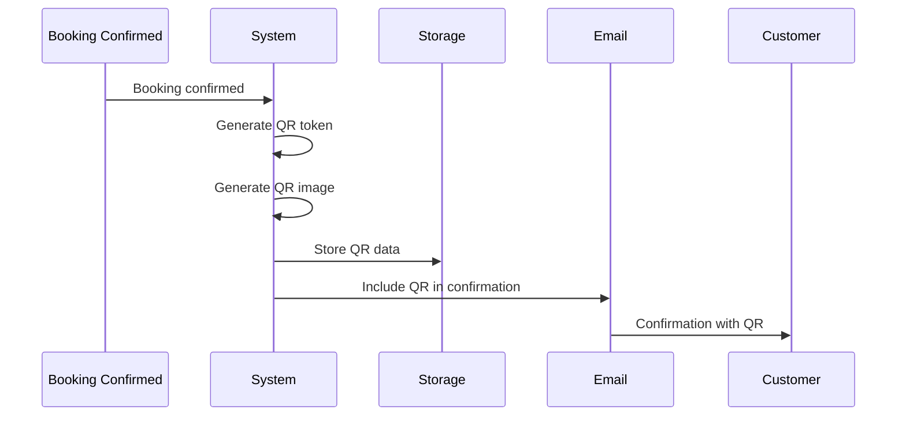
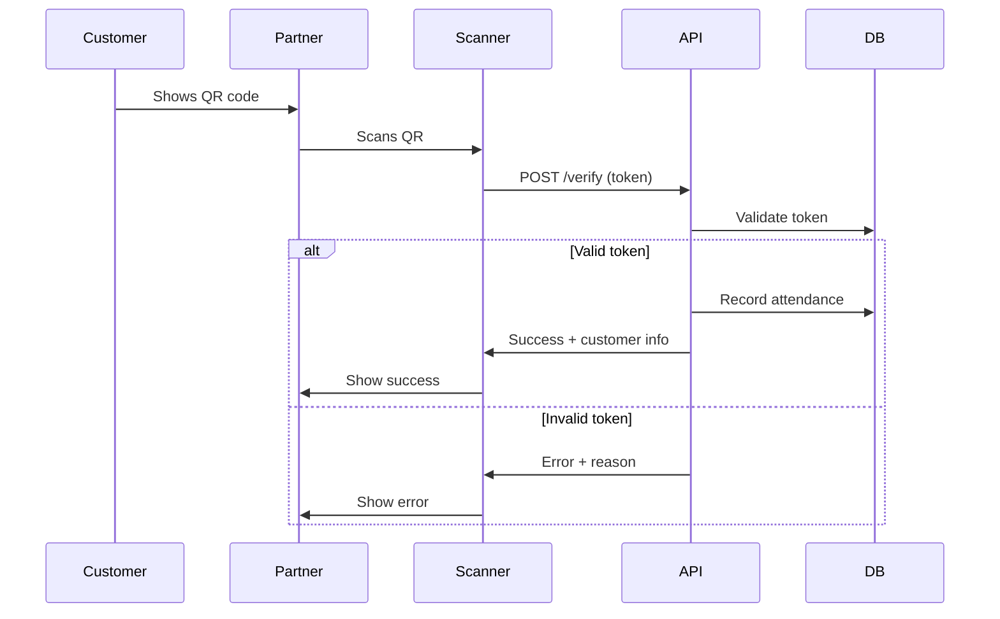

# Feature 04: QR Code Event Verification

**Priority:** Low
**Status:** Planned
**Depends On:** Feature 01 (Booking Confirmation System)
**Estimated Effort:** 1-2 weeks

---

## Table of Contents

1. [Overview](#overview)
2. [User Stories](#user-stories)
3. [Functional Requirements](#functional-requirements)
4. [Technical Architecture](#technical-architecture)
5. [Database Schema](#database-schema)
6. [API Endpoints](#api-endpoints)
7. [UI Components](#ui-components)
8. [QR Code Design](#qr-code-design)
9. [Workflows](#workflows)
10. [Implementation Tasks](#implementation-tasks)

---

## Overview

Partners verify customer attendance at events by scanning QR codes. This provides proof of attendance and enables post-event workflows (reviews, feedback, etc.).

### Problem Statement

- No way to verify customers actually attended
- Difficult to track no-shows
- Cannot trigger post-event communications (reviews)
- Manual attendance tracking is error-prone

### Solution

A QR code system where:
1. Each booking gets a unique QR code
2. QR code sent to customer in booking confirmation
3. Partner scans QR at event check-in
4. Attendance recorded automatically
5. Post-event workflows triggered (review requests, etc.)

---

## User Stories

### Customer Stories

| ID | Story | Acceptance Criteria |
|----|-------|---------------------|
| US-1 | As a customer, I want to receive a QR code for my booking | QR code in confirmation email and accessible online |
| US-2 | As a customer, I want to show my QR code on my phone | Mobile-friendly QR display page |
| US-3 | As a customer, I want a backup if QR doesn't work | Order number lookup as fallback |

### Partner Stories

| ID | Story | Acceptance Criteria |
|----|-------|---------------------|
| US-4 | As a partner, I want to scan customer QR codes | Scanner page in portal |
| US-5 | As a partner, I want to see who has checked in | Attendance list for each event |
| US-6 | As a partner, I want to manually check in customers | Manual entry option |
| US-7 | As a partner, I want to see no-shows | Report of customers who didn't attend |

---

## Functional Requirements

### FR-1: QR Code Generation

| Requirement | Description |
|-------------|-------------|
| FR-1.1 | Generate unique QR code per booking |
| FR-1.2 | QR contains verification URL with token |
| FR-1.3 | QR generated on booking confirmation |
| FR-1.4 | QR code stored as image (PNG/SVG) |
| FR-1.5 | QR valid only for specific event date |

### FR-2: QR Code Distribution

| Requirement | Description |
|-------------|-------------|
| FR-2.1 | Include QR in booking confirmation email |
| FR-2.2 | Customer can access QR via unique link |
| FR-2.3 | QR page works on mobile (optimized size) |
| FR-2.4 | Option to add QR to Apple/Google Wallet |

### FR-3: Scanning & Verification

| Requirement | Description |
|-------------|-------------|
| FR-3.1 | Scanner page using device camera |
| FR-3.2 | Scan validates booking and event date |
| FR-3.3 | Success shows customer name and booking details |
| FR-3.4 | Error shows reason (invalid, wrong date, already scanned) |
| FR-3.5 | Manual order number entry as backup |

### FR-4: Attendance Tracking

| Requirement | Description |
|-------------|-------------|
| FR-4.1 | Record check-in time |
| FR-4.2 | Track all attendees per event |
| FR-4.3 | Report no-shows (confirmed but not checked in) |
| FR-4.4 | Export attendance data |

### FR-5: Post-Event Actions

| Requirement | Description |
|-------------|-------------|
| FR-5.1 | Trigger review request email after check-in |
| FR-5.2 | Configurable delay (e.g., 24h after event) |
| FR-5.3 | Only send to checked-in customers |

---

## Technical Architecture

### System Overview

```
┌─────────────────────────────────────────────────────────────────────────┐
│                        QR Verification System                            │
│                                                                          │
│  ┌─────────────────┐                     ┌─────────────────┐            │
│  │   Customer      │                     │    Partner      │            │
│  │   Shows QR      │                     │    Scanner      │            │
│  └────────┬────────┘                     └────────┬────────┘            │
│           │                                       │                      │
│           │                                       │                      │
│           │    ┌───────────────────────────┐     │                      │
│           │    │                           │     │                      │
│           └───▶│     QR Code              │◀────┘                      │
│                │  /verify/{token}          │                            │
│                │                           │                            │
│                └─────────────┬─────────────┘                            │
│                              │                                          │
│                              ▼                                          │
│                     ┌────────────────┐                                  │
│                     │   Verify API   │                                  │
│                     └────────┬───────┘                                  │
│                              │                                          │
└──────────────────────────────┼──────────────────────────────────────────┘
                               │
                               ▼
                      ┌────────────────┐
                      │   PostgreSQL   │
                      │  - Attendance  │
                      │  - QR Tokens   │
                      └────────────────┘
```

### QR Code Content

```
https://partners.miomente.de/verify/{token}

Where token = base64(bookingId:eventDate:checksum)
Example: aHR0cHM6Ly9wYXJ0bmVycy5taW9tZW50ZS5kZS92ZXJpZnkvMTIzNDU2
```

---

## Database Schema

### PostgreSQL: QR Codes Table

```sql
CREATE TABLE miomente_partner_portal_qr_codes (
  id SERIAL PRIMARY KEY,

  -- Booking reference
  confirmation_id INT NOT NULL REFERENCES miomente_partner_portal_booking_confirmations(id),
  magento_order_id INT NOT NULL,
  magento_order_item_id INT NOT NULL,

  -- Event details
  event_date DATE NOT NULL,
  customer_number VARCHAR(50) NOT NULL,

  -- QR token
  qr_token VARCHAR(128) UNIQUE NOT NULL,
  qr_image_url TEXT, -- Stored QR code image

  -- Status
  status VARCHAR(20) DEFAULT 'active', -- active, scanned, expired, cancelled

  -- Scan details
  scanned_at TIMESTAMP,
  scanned_by VARCHAR(100),
  scan_location VARCHAR(255),

  created_at TIMESTAMP DEFAULT NOW()
);

CREATE INDEX idx_qr_token ON miomente_partner_portal_qr_codes(qr_token);
CREATE INDEX idx_qr_confirmation ON miomente_partner_portal_qr_codes(confirmation_id);
CREATE INDEX idx_qr_event_date ON miomente_partner_portal_qr_codes(event_date, customer_number);
```

### PostgreSQL: Attendance Records

```sql
CREATE TABLE miomente_partner_portal_attendance (
  id SERIAL PRIMARY KEY,

  -- Event reference
  customer_number VARCHAR(50) NOT NULL,
  event_date DATE NOT NULL,
  course_id INT,

  -- Booking reference
  confirmation_id INT REFERENCES miomente_partner_portal_booking_confirmations(id),
  qr_code_id INT REFERENCES miomente_partner_portal_qr_codes(id),

  -- Customer details
  customer_name VARCHAR(255),
  customer_email VARCHAR(255),
  participants INT DEFAULT 1,

  -- Check-in details
  check_in_method VARCHAR(20), -- qr_scan, manual
  checked_in_at TIMESTAMP,
  checked_in_by VARCHAR(100),

  -- Post-event
  review_request_sent_at TIMESTAMP,

  created_at TIMESTAMP DEFAULT NOW()
);

CREATE INDEX idx_attendance_event ON miomente_partner_portal_attendance(customer_number, event_date);
CREATE INDEX idx_attendance_confirmation ON miomente_partner_portal_attendance(confirmation_id);
```

---

## API Endpoints

### POST /api/partner/qr/verify

Verify a QR code scan.

```typescript
// Request
{
  token: string;
}

// Success Response
{
  data: {
    valid: true;
    booking: {
      orderNumber: string;
      customerName: string;
      courseName: string;
      eventDate: string;
      participants: number;
      alreadyScanned: boolean;
    };
    message: string;
  };
  success: true;
}

// Error Response
{
  data: {
    valid: false;
    reason: 'invalid' | 'expired' | 'wrong_date' | 'cancelled';
    message: string;
  };
  success: false;
}
```

---

### POST /api/partner/attendance/check-in

Record manual check-in.

```typescript
// Request
{
  orderNumber?: string;
  customerEmail?: string;
  eventDate: string;
}

// Response
{
  data: {
    attendanceId: number;
    customerName: string;
    participants: number;
  };
  success: true;
}
```

---

### GET /api/partner/attendance/:eventDate

Get attendance for a specific event date.

```typescript
// Response
{
  data: {
    eventDate: string;
    courseName: string;
    attendees: Array<{
      customerName: string;
      participants: number;
      checkedIn: boolean;
      checkInTime?: string;
      checkInMethod?: string;
    }>;
    summary: {
      expected: number;
      checkedIn: number;
      noShows: number;
    };
  };
}
```

---

### GET /api/customer/qr/:token

Customer-facing QR code page (no auth).

```typescript
// Response (HTML page with QR code display)
// Or JSON for API:
{
  data: {
    qrCode: string; // Base64 image
    booking: {
      orderNumber: string;
      courseName: string;
      eventDate: string;
      eventTime: string;
      location: string;
    };
  };
}
```

---

## UI Components

### Partner: Scanner Page

```
┌─────────────────────────────────────────────────────────────────┐
│  QR-Code Scanner                                                │
├─────────────────────────────────────────────────────────────────┤
│                                                                  │
│  ┌────────────────────────────────────────────────────────────┐ │
│  │                                                             │ │
│  │                                                             │ │
│  │                    📷 Camera View                          │ │
│  │                                                             │ │
│  │               [Position QR code here]                       │ │
│  │                                                             │ │
│  │                                                             │ │
│  └────────────────────────────────────────────────────────────┘ │
│                                                                  │
│  Oder Bestellnummer eingeben:                                   │
│  ┌────────────────────────────┐ [Suchen]                        │
│  │ #100012345                 │                                 │
│  └────────────────────────────┘                                 │
│                                                                  │
└─────────────────────────────────────────────────────────────────┘
```

### Partner: Scan Success

```
┌─────────────────────────────────────────────────────────────────┐
│                                                                  │
│                         ✅                                       │
│                                                                  │
│               Check-in erfolgreich!                             │
│                                                                  │
│  ┌────────────────────────────────────────────────────────────┐ │
│  │                                                             │ │
│  │  Kunde: Max Mustermann                                      │ │
│  │  Bestellung: #100012345                                     │ │
│  │  Kurs: Sushi-Kurs für Anfänger                             │ │
│  │  Teilnehmer: 2                                              │ │
│  │                                                             │ │
│  └────────────────────────────────────────────────────────────┘ │
│                                                                  │
│               [Nächsten scannen]                                │
│                                                                  │
└─────────────────────────────────────────────────────────────────┘
```

### Partner: Scan Error

```
┌─────────────────────────────────────────────────────────────────┐
│                                                                  │
│                         ❌                                       │
│                                                                  │
│               Check-in fehlgeschlagen                           │
│                                                                  │
│  Grund: QR-Code ist für einen anderen Termin                    │
│                                                                  │
│  Dieser QR-Code gilt für: 25.01.2025                           │
│  Heute ist: 26.01.2025                                          │
│                                                                  │
│               [Erneut versuchen]                                │
│                                                                  │
└─────────────────────────────────────────────────────────────────┘
```

### Partner: Attendance List

```
┌─────────────────────────────────────────────────────────────────┐
│  Teilnehmerliste                                                │
├─────────────────────────────────────────────────────────────────┤
│                                                                  │
│  Termin: [📅 25.01.2025 ▼]                                      │
│  Kurs: Sushi-Kurs für Anfänger                                  │
│                                                                  │
│  Zusammenfassung: 8/10 eingecheckt                              │
│                                                                  │
│  ┌────────────────────────────────────────────────────────────┐ │
│  │ ✅ Max Mustermann (2)        | 17:55 | QR-Scan            │ │
│  │ ✅ Erika Beispiel (1)        | 17:58 | QR-Scan            │ │
│  │ ✅ Hans Schmidt (2)          | 18:02 | Manuell            │ │
│  │ ✅ Anna Weber (1)            | 18:05 | QR-Scan            │ │
│  │ ✅ Peter Meier (2)           | 18:10 | QR-Scan            │ │
│  │ ⚪ Julia Fischer (1)         | -     | [Check-in]         │ │
│  │ ⚪ Thomas Braun (1)          | -     | [Check-in]         │ │
│  └────────────────────────────────────────────────────────────┘ │
│                                                                  │
│  [Exportieren (CSV)]                                            │
│                                                                  │
└─────────────────────────────────────────────────────────────────┘
```

### Customer: QR Code Page

```
┌─────────────────────────────────────────────────────────────────┐
│                                                                  │
│                    Ihre Buchung                                 │
│                                                                  │
│  ┌────────────────────────────────────────────────────────────┐ │
│  │                                                             │ │
│  │                    ██████████████                           │ │
│  │                    ██          ██                           │ │
│  │                    ██  ██████  ██                           │ │
│  │                    ██  ██████  ██                           │ │
│  │                    ██  ██████  ██                           │ │
│  │                    ██          ██                           │ │
│  │                    ██████████████                           │ │
│  │                                                             │ │
│  └────────────────────────────────────────────────────────────┘ │
│                                                                  │
│  Bestellung: #100012345                                         │
│  Kurs: Sushi-Kurs für Anfänger                                  │
│  Datum: Samstag, 25.01.2025                                     │
│  Zeit: 18:00 Uhr                                                │
│  Teilnehmer: 2                                                  │
│                                                                  │
│  📍 Kochstudio München                                          │
│     Musterstraße 123, 80333 München                             │
│                                                                  │
│  Zeigen Sie diesen QR-Code beim Check-in vor.                   │
│                                                                  │
│  [Zu Apple Wallet hinzufügen]                                   │
│  [Zu Google Wallet hinzufügen]                                  │
│                                                                  │
└─────────────────────────────────────────────────────────────────┘
```

---

## QR Code Design

### QR Generation

```typescript
// src/lib/utils/qr-generator.ts
import QRCode from 'qrcode';

interface QRGenerationOptions {
  bookingId: number;
  eventDate: string;
  customerNumber: string;
}

async function generateBookingQR(options: QRGenerationOptions): Promise<{
  token: string;
  imageDataUrl: string;
  imageBuffer: Buffer;
}> {
  // Generate secure token
  const token = generateSecureToken(options);

  // Create verification URL
  const verifyUrl = `${process.env.NEXT_PUBLIC_APP_URL}/verify/${token}`;

  // Generate QR code
  const imageDataUrl = await QRCode.toDataURL(verifyUrl, {
    width: 300,
    margin: 2,
    color: {
      dark: '#000000',
      light: '#ffffff',
    },
  });

  const imageBuffer = await QRCode.toBuffer(verifyUrl, {
    width: 600,
    margin: 2,
  });

  return { token, imageDataUrl, imageBuffer };
}
```

### Token Structure

```typescript
// Secure token generation
function generateSecureToken(options: QRGenerationOptions): string {
  const data = {
    bid: options.bookingId,
    date: options.eventDate,
    cn: options.customerNumber,
    ts: Date.now(),
  };

  const payload = Buffer.from(JSON.stringify(data)).toString('base64url');
  const signature = createHmac('sha256', process.env.QR_SECRET!)
    .update(payload)
    .digest('base64url')
    .slice(0, 16);

  return `${payload}.${signature}`;
}
```

---

## Workflows

### Workflow: QR Code Generation & Distribution



### Workflow: Event Check-in



---

## Implementation Tasks

### Phase 1: QR Generation (Days 1-3)

| Task | Description |
|------|-------------|
| 1.1 | Create QR codes database table |
| 1.2 | Implement token generation |
| 1.3 | Implement QR image generation |
| 1.4 | Integrate with booking confirmation |

### Phase 2: Customer Experience (Days 4-5)

| Task | Description |
|------|-------------|
| 2.1 | Add QR to confirmation email template |
| 2.2 | Create customer QR code view page |
| 2.3 | Mobile-optimize QR display |

### Phase 3: Partner Scanner (Days 6-8)

| Task | Description |
|------|-------------|
| 3.1 | Create scanner page with camera access |
| 3.2 | Implement QR decoding |
| 3.3 | Create verification API |
| 3.4 | Add manual check-in option |

### Phase 4: Attendance Tracking (Days 9-10)

| Task | Description |
|------|-------------|
| 4.1 | Create attendance list page |
| 4.2 | Implement no-show reporting |
| 4.3 | Add CSV export |

---

## File Structure

```
src/
├── app/
│   ├── api/
│   │   └── partner/
│   │       ├── qr/
│   │       │   └── verify/
│   │       │       └── route.ts
│   │       └── attendance/
│   │           ├── route.ts
│   │           └── [date]/
│   │               └── route.ts
│   ├── dashboard/
│   │   ├── scanner/
│   │   │   └── page.tsx
│   │   └── attendance/
│   │       └── page.tsx
│   └── verify/
│       └── [token]/
│           └── page.tsx    # Customer QR display
├── components/
│   ├── qr-scanner.tsx
│   └── qr-display.tsx
├── lib/
│   └── utils/
│       └── qr-generator.ts
└── ...
```

---

## Dependencies

**New dependencies:**
- `qrcode` - QR code generation
- `html5-qrcode` or `@zxing/browser` - QR scanning in browser

---

## Open Questions

1. **Wallet integration:** Worth the effort for Apple/Google Wallet?
2. **Offline scanning:** Need to work without internet?
3. **Multi-scan:** Can same QR be scanned multiple times (multiple participants)?
4. **Barcode support:** Also support traditional barcodes?

---

## Changelog

| Date | Author | Change |
|------|--------|--------|
| 2025-01-21 | Claude | Initial specification created |
