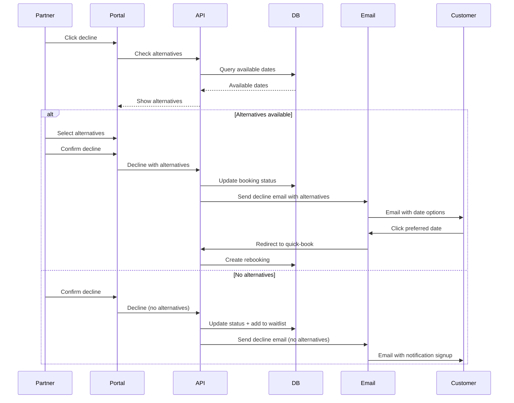
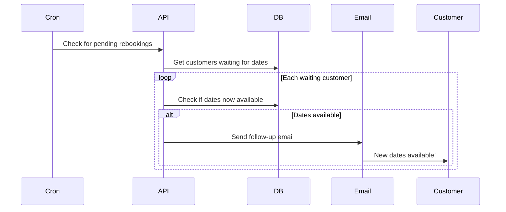

# Feature 05: Enhanced Decline with Alternative Dates

**Priority:** Low
**Status:** Planned
**Depends On:** Feature 01 (Booking Confirmation), Feature 02 (Rebooking System)
**Estimated Effort:** 1 week

---

## Table of Contents

1. [Overview](#overview)
2. [User Stories](#user-stories)
3. [Functional Requirements](#functional-requirements)
4. [Technical Architecture](#technical-architecture)
5. [UI Components](#ui-components)
6. [Email System](#email-system)
7. [Workflows](#workflows)
8. [Implementation Tasks](#implementation-tasks)

---

## Overview

When a partner declines a booking, the system automatically finds and suggests alternative dates to the customer, reducing friction and improving rebooking rates.

### Problem Statement

In the basic decline flow (Feature 01):
- Customer receives generic "your booking was declined" email
- Customer must manually find new dates
- High friction leads to refund requests
- Missed rebooking opportunities

### Solution

An enhanced decline flow where:
1. System automatically finds available dates for the same course
2. If alternatives exist, customer email includes top 3 options
3. One-click selection directly from email
4. If no alternatives, trigger website parsing (Feature 03)
5. Partner can also manually propose specific dates

---

## User Stories

### Customer Stories

| ID | Story | Acceptance Criteria |
|----|-------|---------------------|
| US-1 | As a customer, I want to see alternative dates in decline email | Email shows available dates |
| US-2 | As a customer, I want to select a new date with one click | Direct booking link per date |
| US-3 | As a customer, I want to be notified when dates become available | Follow-up email if dates found later |

### Partner Stories

| ID | Story | Acceptance Criteria |
|----|-------|---------------------|
| US-4 | As a partner, I want to propose specific alternative dates | Selection UI in decline flow |
| US-5 | As a partner, I want to see which alternatives were offered | History in booking details |

---

## Functional Requirements

### FR-1: Automatic Alternative Detection

| Requirement | Description |
|-------------|-------------|
| FR-1.1 | Query available dates for same course when declining |
| FR-1.2 | Filter: future dates only |
| FR-1.3 | Filter: dates with available capacity |
| FR-1.4 | Sort by proximity to original date |
| FR-1.5 | Limit to top 3 alternatives |

### FR-2: Partner-Proposed Alternatives

| Requirement | Description |
|-------------|-------------|
| FR-2.1 | "Propose alternative" checkbox in decline modal |
| FR-2.2 | Show available dates for selection |
| FR-2.3 | Partner can select 1-3 dates to propose |
| FR-2.4 | Proposed dates highlighted in customer email |

### FR-3: Customer Selection

| Requirement | Description |
|-------------|-------------|
| FR-3.1 | Direct booking links in email (token-based) |
| FR-3.2 | One click completes rebooking |
| FR-3.3 | Fallback link to rebooking page (Feature 02) |

### FR-4: No Alternatives Handling

| Requirement | Description |
|-------------|-------------|
| FR-4.1 | If no dates available, trigger website parsing |
| FR-4.2 | Customer email says "we're looking for alternatives" |
| FR-4.3 | Follow-up email if dates found within 7 days |
| FR-4.4 | Escalate to support if no dates found |

---

## Technical Architecture

### Decision Flow

```
Partner clicks Decline
         ↓
Query available dates for same course
         ↓
    ┌────┴────┐
    ↓         ↓
 Dates     No dates
 found     available
    ↓         ↓
Include   Trigger
in email  parsing
    ↓         ↓
Customer  Monitor for
selects   new dates
    ↓         ↓
Rebook    Send follow-up
                if found
```

### Alternative Date Selection

```typescript
interface AlternativeDateQuery {
  courseId: number;
  originalDate: string;
  participants: number;
  excludeDates?: string[]; // Dates to exclude
}

interface AlternativeDate {
  dateId: number;
  date: string;
  time: string;
  spotsAvailable: number;
  price: number;
  proximityDays: number; // Days from original
  selectionToken: string; // One-click booking token
}

async function findAlternativeDates(
  query: AlternativeDateQuery
): Promise<AlternativeDate[]> {
  // 1. Get available dates for course
  // 2. Filter by availability >= participants
  // 3. Sort by proximity to original date
  // 4. Generate selection tokens
  // 5. Return top 3
}
```

---

## UI Components

### Enhanced Decline Modal

```
┌─────────────────────────────────────────────────────────────────┐
│  Buchung ablehnen                                        [X]   │
├─────────────────────────────────────────────────────────────────┤
│                                                                  │
│  Bitte wählen Sie einen Grund:                                  │
│  ○ Termin nicht mehr verfügbar                                  │
│  ○ Kapazität erschöpft                                          │
│  ○ Sonstiges                                                    │
│                                                                  │
│  ────────────────────────────────────────────────────────────── │
│                                                                  │
│  ☑ Alternative Termine vorschlagen                              │
│                                                                  │
│  ┌────────────────────────────────────────────────────────────┐ │
│  │ Verfügbare Termine (wählen Sie bis zu 3):                  │ │
│  │                                                             │ │
│  │ ☑ Sa. 01.02.2025, 18:00 (5 Plätze frei)                   │ │
│  │ ☑ Sa. 08.02.2025, 18:00 (8 Plätze frei)                   │ │
│  │ ☐ So. 15.02.2025, 14:00 (3 Plätze frei)                   │ │
│  │ ☐ Sa. 22.02.2025, 18:00 (10 Plätze frei)                  │ │
│  │                                                             │ │
│  └────────────────────────────────────────────────────────────┘ │
│                                                                  │
│  💡 Diese Termine werden dem Kunden als Alternative angeboten.  │
│                                                                  │
│                    [Abbrechen]  [Ablehnen & Vorschlagen]        │
│                                                                  │
└─────────────────────────────────────────────────────────────────┘
```

### No Alternatives Available State

```
┌─────────────────────────────────────────────────────────────────┐
│  Buchung ablehnen                                        [X]   │
├─────────────────────────────────────────────────────────────────┤
│                                                                  │
│  Bitte wählen Sie einen Grund:                                  │
│  ● Termin nicht mehr verfügbar                                  │
│                                                                  │
│  ────────────────────────────────────────────────────────────── │
│                                                                  │
│  ⚠️ Keine alternativen Termine verfügbar                        │
│                                                                  │
│  Der Kunde erhält eine E-Mail mit der Möglichkeit, sich         │
│  benachrichtigen zu lassen, sobald neue Termine verfügbar sind. │
│                                                                  │
│  💡 Tipp: Fügen Sie neue Termine im Kurseditor hinzu!           │
│     [Termine hinzufügen →]                                      │
│                                                                  │
│                    [Abbrechen]  [Ablehnen]                      │
│                                                                  │
└─────────────────────────────────────────────────────────────────┘
```

---

## Email System

### Email: Decline with Alternatives

**Subject:** `Terminänderung - Wählen Sie einen neuen Termin`

```html
Hallo {customer_name},

leider kann Ihr gebuchter Termin nicht stattfinden:

URSPRÜNGLICHE BUCHUNG
─────────────────────
Kurs: {course_name}
Termin: {original_date} (nicht verfügbar)
Grund: {decline_reason}

ALTERNATIVE TERMINE
───────────────────
Wir haben folgende Alternativen für Sie:

┌────────────────────────────────────────────┐
│ 📅 Samstag, 01.02.2025 um 18:00 Uhr       │
│    5 Plätze verfügbar | 89,00 €           │
│    [DIESEN TERMIN WÄHLEN]                 │
└────────────────────────────────────────────┘

┌────────────────────────────────────────────┐
│ 📅 Samstag, 08.02.2025 um 18:00 Uhr       │
│    8 Plätze verfügbar | 89,00 €           │
│    [DIESEN TERMIN WÄHLEN]                 │
└────────────────────────────────────────────┘

┌────────────────────────────────────────────┐
│ 📅 Sonntag, 15.02.2025 um 14:00 Uhr       │
│    3 Plätze verfügbar | 89,00 €           │
│    [DIESEN TERMIN WÄHLEN]                 │
└────────────────────────────────────────────┘

Kein passender Termin dabei?
[Alle verfügbaren Termine anzeigen →]

Mit freundlichen Grüßen,
Ihr Miomente Team
```

### Email: Decline without Alternatives

**Subject:** `Terminänderung für Ihre Buchung`

```html
Hallo {customer_name},

leider kann Ihr gebuchter Termin nicht stattfinden:

URSPRÜNGLICHE BUCHUNG
─────────────────────
Kurs: {course_name}
Termin: {original_date} (nicht verfügbar)
Grund: {decline_reason}

WIR SUCHEN FÜR SIE
──────────────────
Aktuell sind keine Alternativtermine verfügbar. Wir suchen aktiv
nach neuen Terminen und informieren Sie, sobald welche verfügbar sind.

Möchten Sie benachrichtigt werden?
[JA, BITTE BENACHRICHTIGEN]

Oder kontaktieren Sie uns:
📧 support@miomente.de
📞 +49 xxx xxxxxxx

Mit freundlichen Grüßen,
Ihr Miomente Team
```

### Email: Follow-up (Alternatives Found Later)

**Subject:** `Gute Nachrichten: Neue Termine für {course_name}!`

```html
Hallo {customer_name},

wir haben neue Termine für Ihren Kurs gefunden!

[List of new alternatives with booking links]

Mit freundlichen Grüßen,
Ihr Miomente Team
```

---

## Workflows

### Workflow: Decline with Alternatives



### Workflow: Follow-up when Dates Found



---

## Database Extensions

### Add to booking_confirmations table

```sql
-- Add columns for alternative tracking
ALTER TABLE miomente_partner_portal_booking_confirmations
ADD COLUMN alternatives_offered JSONB,
ADD COLUMN alternative_selected_id INT,
ADD COLUMN notify_when_available BOOLEAN DEFAULT false;

-- Track waiting customers
CREATE TABLE miomente_partner_portal_date_waitlist (
  id SERIAL PRIMARY KEY,
  customer_email VARCHAR(255) NOT NULL,
  customer_name VARCHAR(255),
  course_id INT NOT NULL,
  original_confirmation_id INT REFERENCES miomente_partner_portal_booking_confirmations(id),
  participants INT NOT NULL,
  notified_at TIMESTAMP,
  status VARCHAR(20) DEFAULT 'waiting', -- waiting, notified, converted, expired
  created_at TIMESTAMP DEFAULT NOW()
);

CREATE INDEX idx_waitlist_course ON miomente_partner_portal_date_waitlist(course_id, status);
```

---

## Implementation Tasks

### Phase 1: Core Alternative Logic (Days 1-2)

| Task | Description |
|------|-------------|
| 1.1 | Create alternative date finder function |
| 1.2 | Generate one-click selection tokens |
| 1.3 | Update decline API to include alternatives |

### Phase 2: Partner UI (Days 3-4)

| Task | Description |
|------|-------------|
| 2.1 | Update decline modal with alternatives |
| 2.2 | Add alternative selection UI |
| 2.3 | Handle no-alternatives case |

### Phase 3: Customer Emails (Days 5-6)

| Task | Description |
|------|-------------|
| 3.1 | Create email template with alternatives |
| 3.2 | Create email template without alternatives |
| 3.3 | Implement one-click booking from email |

### Phase 4: Follow-up System (Day 7)

| Task | Description |
|------|-------------|
| 4.1 | Create waitlist tracking |
| 4.2 | Implement follow-up notification job |
| 4.3 | Test end-to-end flow |

---

## File Structure

```
src/
├── app/
│   ├── api/
│   │   └── partner/
│   │       └── bookings/
│   │           └── [id]/
│   │               └── decline/
│   │                   └── route.ts  # Enhanced with alternatives
│   │   └── select-date/
│   │       └── [token]/
│   │           └── route.ts          # One-click booking
│   │   └── cron/
│   │       └── date-waitlist/
│   │           └── route.ts          # Follow-up checker
├── lib/
│   ├── services/
│   │   └── alternative-finder.ts     # Find alternatives
│   └── email/
│       └── decline-alternatives.ts   # Email templates
└── ...
```

---

## Open Questions

1. **Partner override:** Can partner choose NOT to show alternatives?
2. **Price difference:** Handle if alternative has different price?
3. **Waitlist duration:** How long to keep customers on waitlist?
4. **Integration with parsing:** Trigger parse immediately on no alternatives?

---

## Changelog

| Date | Author | Change |
|------|--------|--------|
| 2025-01-21 | Claude | Initial specification created |
