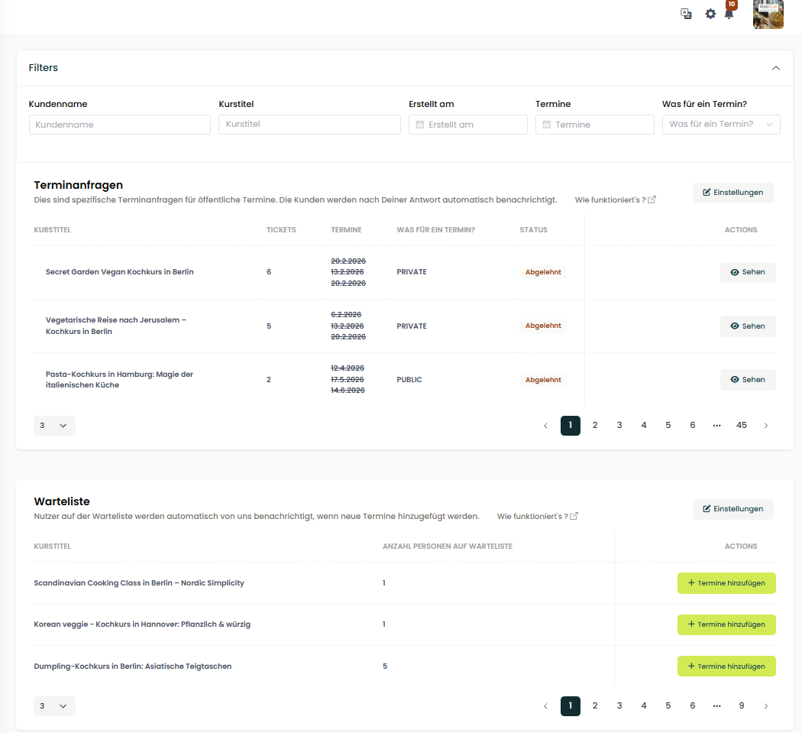

Правки по фронтенду:

2. добавить пункты меню Bestellungen, Buchhaltung
3. в них пока напиши "In Entwicklung. Coming soon"
4. по дизайну пунктам и функционалу посмотри на картинке у конкурентов на их подобном портале, и создай ТЗ что еще сделаем
Дизайн и функционал конкурентов (скриншот с их кабинета): 
Вижу там графики есть по обороту
Функционал по сбору отзывов
Провалится в заказ можно
Например, тут можно сделать подобный функционал подтверждения заказов (скриншот с их кабинета) 
По функционалу отправок смс и прозвона
5. сделать возможность внести ивенты которые повторяются, например каждый месяц чтоб термины создавались сами, чтоб не создавать руками

Вот подитоживание функционала конкурентов, к которому нам нужно стремиться:
1. Управление контентом и расписанием:
   ◦ Курсы (Kurse): Центральный раздел для создания и редактирования описаний кулинарных мероприятий.
   ◦ Управление датами (Termine): Инструментарий для ведения календаря и актуализации доступных слотов для бронирования.
2. Операционная деятельность и финансы:
   ◦ Бронирования (Buchungen): Система мониторинга и управления входящими заказами от клиентов.
   ◦ Расчеты и финансы (Abrechnung und Finanzen): Модуль для работы со счетами и отслеживания платежей.
   ◦ Корпоративные и частные мероприятия: Отдельный функционал для обработки запросов на командные и приватные ивенты.
3. Маркетинг и развитие:
   ◦ Оптимизация предложений: Инструменты для улучшения позиций курсов в поиске Google и повышения качества контента.
   ◦ Лучшие практики (Best Practice): Раздел с успешными концепциями курсов и рекомендациями по ценообразованию.
4. Техническая интеграция и поддержка:
   ◦ Интерфейсы API (Schnittstellen): Возможность интеграции портала с внешними системами партнеров.
   ◦ Виджеты бронирования: Решение, позволяющее партнерам устанавливать форму бронирования прямо на свои сайты.
   ◦ Центр обновлений и коммуникация: Информирование партнеров о новых функциях и прямая связь с поддержкой.

- перенеси все в чеклист задачи плиз
